# gridwatch: project plan and architecture

Status as of 3 October 2026, UTC (commit `5f0fbff` on `main`). This plan describes what the code does
today, marks what is pending, and lists the remaining work in order. Material that already has
a home is summarised and linked rather than repeated: the [README](README.md), the
[decision records](docs/decisions.md), the [data notes and runbook](docs/data.md), the
[forecast method](docs/forecast.md), the [findings](docs/findings.md) and the
[Power BI guide](powerbi/README.md).

**Contents**

1. [Overview](#1-overview)
2. [Requirements](#2-requirements)
3. [Architecture](#3-architecture)
4. [Modules](#4-modules)
5. [End-to-end feature workflows](#5-end-to-end-feature-workflows)
6. [Cross-cutting concerns](#6-cross-cutting-concerns)
7. [Execution roadmap](#7-execution-roadmap)

## 1. Overview

### Purpose and scope

gridwatch answers two sets of questions from open data. For Great Britain: when is electricity
cleanest, how much carbon does moving a flexible load save, and how far ahead can that be
predicted? For the Gulf: how far behind the UK and the EU are the UAE and the other GCC
countries, and is the gap closing?

It is a batch data product, not a service. One Python command, `gridwatch`, ingests two public
sources into Parquet, builds a tested DuckDB warehouse with dbt, forecasts the next 48 hours,
backtests that forecast, writes a report, and generates a static dashboard and CSV exports.
There is no server process, no database service and no user account: every step is a command
that reads and writes files, run by hand or by a scheduled GitHub Actions workflow that
publishes the result to GitHub Pages.

| In scope | Out of scope today (see the README's limitations) |
| --- | --- |
| GB national half-hourly intensity since 2017-09-26, national generation mix since 2018-05-10, regional intensity and mix (from 2023-01-01 by default) | Weather, wind and demand forecasts as model inputs |
| The API's own 48-hour forecast, stored as issued on each run | Marginal emissions |
| Ember yearly data for the UAE, Saudi Arabia, Qatar, Kuwait, Bahrain, Oman, the UK, the EU-27 and the world | Monthly GCC data |
| Dashboard, report, annual CSV, Power BI star schema | A history of revised API actuals (they overwrite) |

### Current status

| Area | Status | Evidence |
| --- | --- | --- |
| Python package, dbt project, test suite | Built | `src/gridwatch/`, `dbt/`, `tests/` |
| CI on GitHub | Built and passing | CI run 37036664054 (push to `main`, 2 October 2026): lint, tests on Python 3.12 and 3.13, and the fixture pipeline all passed; so did the runs for PR #1 (initial build) and PR #2 (Dependabot DuckDB update) |
| Daily pipeline | Built; ran once, deploy failed | Scheduled run 37116374067 (3 October 2026): the build job passed in 24 min 28 s from an empty cache (338 HTTP requests, `dbt build` with 214 nodes and 4 warnings, 365-origin backtest). The deploy job failed with "Failed to create deployment (status: 404) ... Ensure GitHub Pages has been enabled" |
| Dashboard on GitHub Pages | Pending | Pages is not enabled for the repository (`GET /repos/fasharif/gridwatch/pages` answers 404). The forecast snapshot taken on 3 October exists only in the Actions cache and in that run's `forecast-snapshots` artifact (kept 90 days) |
| Committed findings and report | Built | [docs/findings.md](docs/findings.md), [docs/generated/report.md](docs/generated/report.md), from data ingested on 2026-09-25 |
| Power BI report (`.pbix`) | Not built | [powerbi/README.md](powerbi/README.md) has the CSVs, untested DAX measures and a build guide |
| Like-for-like accuracy of the API's day-ahead forecast | Pending data | `rpt_api_forecast_snapshot_accuracy` needs weeks of daily snapshots |
| Timing tables | Pending | [docs/generated/timings.md](docs/generated/timings.md) and [timings-full.md](docs/generated/timings-full.md) still say "pending" |
| README roadmap items 1 to 4 | Planned | [README, Limitations and roadmap](README.md#limitations-and-roadmap) |

The README's "Not run yet" section was written before the runs above, so it still says the
workflows have not run on GitHub; updating it is the first item of the
[execution roadmap](#7-execution-roadmap).

### Tech stack

Versions are those in `uv.lock` unless stated otherwise.

| Layer | Technology | Version | Why chosen |
| --- | --- | --- | --- |
| Language and packaging | Python, uv, hatchling | Python 3.12 (`.python-version`; `requires-python = ">=3.12,<3.14"`, CI also tests 3.13); uv not pinned (installed by `astral-sh/setup-uv` v10.2.0, pinned to a commit); hatchling `>=1.27` | dbt supports 3.12; uv gives a lockfile and reproducible installs ([decision 1](docs/decisions.md#1-python-312-uv-and-a-lockfile)) |
| HTTP | httpx | 0.28.1 | Injectable transports for replaying recorded responses |
| Data frames and raw storage | polars, pyarrow, Parquet | polars 1.44.2, pyarrow 25.0.1 | Typed, strict schemas at the ingestion boundary; monthly Parquet files ([decision 3](docs/decisions.md#3-raw-layer-monthly-parquet-with-idempotent-upserts)) |
| Warehouse | DuckDB | 1.5.6 (the committed findings were built with 1.5.5) | One file, no server, reads Parquet directly ([decision 2](docs/decisions.md#2-duckdb-with-dbt-duckdb-as-the-warehouse)) |
| Transformation | dbt-core, dbt-duckdb | 1.12.5, 1.11.0 | Versioned SQL, lineage and tests next to the models |
| Forecasting | scikit-learn `HistGradientBoostingRegressor`, numpy, holidays | 1.9.1, 2.5.3, 0.105 | Quantile loss, native missing values, no system libraries ([decision 9](docs/decisions.md#9-forecast-with-scikit-learn-gradient-boosting)) |
| Statistics | numpy (`src/gridwatch/stats.py`) | as above | Block bootstrap and Diebold-Mariano without another dependency ([decision 19](docs/decisions.md#19-state-the-uncertainty-of-headline-results)) |
| Dashboard | Jinja2, Plotly (Python, with Plotly.js copied into the site), plain CSS and JavaScript | Jinja2 3.1.6, Plotly 7.1.0 | One language end to end, no Node build, no secrets ([decision 11](docs/decisions.md#11-dashboard-generated-html-with-plotly)) |
| Tests and quality | pytest, pytest-socket, pytest-cov, ruff, mypy (strict) | 9.1.1, 0.8.1, 7.1.0, 0.16.9, 2.3.1 | Offline tests, typed code ([decision 14](docs/decisions.md#14-tests-and-ci-never-call-the-network)) |
| Screenshots (optional group) | Playwright | 1.63.0 | Headless Chromium captures for the README |
| CI, scheduling, hosting | GitHub Actions, Actions cache, GitHub Pages, Dependabot; actionlint | `actions/checkout@v7`, `actions/cache/*@v6`, `actions/upload-artifact@v7`, `actions/upload-pages-artifact@v5`, `actions/deploy-pages@v5`; `rhysd/actionlint:1.7.12` | Free for public repositories; third-party actions pinned to a commit ([decision 18](docs/decisions.md#18-pin-third-party-actions-to-a-commit-and-check-every-reference)) |
| Data sources | Carbon Intensity API (NESO), Ember Yearly Electricity Data | Ember file of 22 September 2026 for the findings ([data.md](docs/data.md#sources-and-attribution)) | Public, CC BY 4.0, no key needed |

### System components

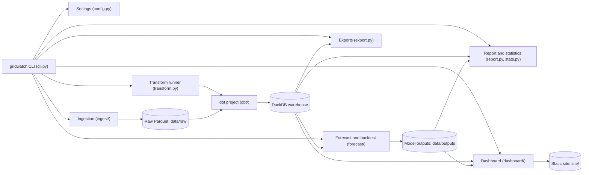
```mermaid
flowchart LR
    CLI["gridwatch CLI (cli.py)"]
    CFG["Settings (config.py)"]
    ING["Ingestion (ingest/)"]
    RAW[("Raw Parquet: data/raw")]
    TR["Transform runner (transform.py)"]
    DBT["dbt project (dbt/)"]
    WH[("DuckDB warehouse")]
    FC["Forecast and backtest (forecast/)"]
    OUT[("Model outputs: data/outputs")]
    REP["Report and statistics (report.py, stats.py)"]
    EXP["Exports (export.py)"]
    DASH["Dashboard (dashboard/)"]
    SITE[("Static site: site/")]
    CLI --> CFG
    CLI --> ING
    CLI --> TR
    CLI --> FC
    CLI --> REP
    CLI --> EXP
    CLI --> DASH
    ING --> RAW
    TR --> DBT
    RAW --> DBT
    DBT --> WH
    WH --> FC
    WH --> REP
    WH --> EXP
    WH --> DASH
    FC --> OUT
    OUT --> REP
    OUT --> DASH
    DASH --> SITE
```

### High-level data flow

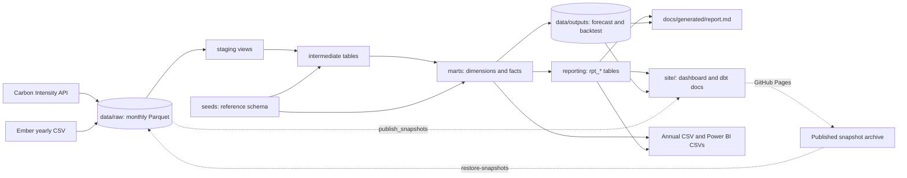
```mermaid
flowchart LR
    API["Carbon Intensity API"]
    EMB["Ember yearly CSV"]
    ARC["Published snapshot archive"]
    RAW[("data/raw: monthly Parquet")]
    SEED["seeds: reference schema"]
    STG["staging views"]
    INT["intermediate tables"]
    MART["marts: dimensions and facts"]
    RPT["reporting: rpt_* tables"]
    OUT[("data/outputs: forecast and backtest")]
    REP["docs/generated/report.md"]
    SITE["site/: dashboard and dbt docs"]
    CSV["Annual CSV and Power BI CSVs"]
    API --> RAW
    EMB --> RAW
    ARC -. "restore-snapshots" .-> RAW
    RAW --> STG --> INT --> MART --> RPT
    SEED --> INT
    SEED --> MART
    MART --> OUT
    RPT --> REP
    OUT --> REP
    RPT --> SITE
    OUT --> SITE
    MART --> CSV
    RPT --> CSV
    RAW -. "publish_snapshots" .-> SITE
    SITE -. "GitHub Pages" .-> ARC
```

## 2. Requirements

Status key: **built** (in the code and tested), **partly built** (code exists, something
outside it is pending), **planned** (not in the code). Module IDs refer to [section 4](#4-modules).

### Functional requirements

| ID | Requirement | Modules | Status |
| --- | --- | --- | --- |
| FR-1 | Ingest GB national half-hourly forecast and actual intensity from 2017-09-26, incrementally, re-requesting the last `GRIDWATCH_REFETCH_DAYS` days because actuals are revised | M4, M6, M7 | Built |
| FR-2 | Ingest the national generation mix from 2018-05-10 23:30 UTC | M4, M6, M7 | Built |
| FR-3 | Ingest regional forecast intensity and mix for 14 DNO regions and 4 aggregates from `GRIDWATCH_REGIONAL_START` | M4, M6, M7 | Built |
| FR-4 | Re-request every hole in the stored history on demand (`--repair-gaps`), region by region for regional data | M4, M7, M17 | Built |
| FR-5 | Ingest Ember's yearly CSV with a conditional download, keeping the stored copy if a later download fails | M5, M7 | Built |
| FR-6 | Store the API's 48-hour forecast as issued on each run | M4, M7 | Built |
| FR-7 | Keep the forecast snapshots between runs by publishing them with the dashboard and restoring them, with SHA-256 checks | M8, M15, M17 | Partly built: publication waits for GitHub Pages |
| FR-8 | Build a tested dimensional warehouse: staging, intermediate, marts (5 dimensions, 7 facts) and reporting | M9, M10 | Built |
| FR-9 | Answer the four business questions in SQL: (a) when to run a flexible job and the saving of seven scheduling rules, (b) GCC against the UK and EU, (c) seasonal and regional variation, (d) accuracy of the API's own forecast | M10 | Built |
| FR-10 | Forecast GB national intensity 48 hours ahead with a calibrated 10-90% interval | M11 | Built |
| FR-11 | Backtest the forecast over a year against persistence, two seasonal naive baselines and the API, with validation runs on an earlier period and a pinnable test period | M12 | Built |
| FR-12 | State the uncertainty of headline results: block-bootstrap intervals and Diebold-Mariano tests | M13 | Built |
| FR-13 | Generate a report that contains every figure quoted in the prose | M13 | Built |
| FR-14 | Generate a static dashboard with a table view for every chart that has data and an explicit empty state otherwise | M15 | Built; public deployment waits for GitHub Pages |
| FR-15 | Publish the dbt docs (models, tests, lineage, exposures) with the dashboard | M9, M17 | Built; publication waits for GitHub Pages |
| FR-16 | Export annual lifecycle intensity as CSV with source and licence on every row | M14 | Built |
| FR-17 | Export a Power BI star schema as CSV with DAX measures and a build guide | M14 | Built (measures untested in Power BI) |
| FR-18 | A Power BI report (`powerbi/gridwatch.pbix`) | M14 | Planned |
| FR-19 | Run the whole chain daily on a schedule, keeping raw data and model outputs between runs | M17 | Partly built: first run on 3 October 2026 built everything, deploy failed |
| FR-20 | Run the whole chain offline from recorded API responses | M3, M18 | Built |
| FR-21 | Report like-for-like accuracy of the API's day-ahead forecast from stored snapshots in the findings | M10, M13 | Planned (needs weeks of snapshots) |
| FR-22 | Use wind and demand forecasts as model inputs | M7, M11 (new ingestion) | Planned |
| FR-23 | Blend the model with persistence for the first hours, with weights chosen on validation data | M11, M12 | Planned |
| FR-24 | Backtest a model that uses the API's own day-ahead forecast as an input | M11, M12 | Planned (needs months of snapshots) |
| FR-25 | Monthly Ember data for the GCC, to show the summer cooling peak | M5, M10, M15 | Planned |
| FR-26 | Marginal rather than average emissions in the scheduling analysis | M10 | Planned |

### Non-functional requirements

| ID | Requirement | Modules | Status |
| --- | --- | --- | --- |
| NFR-1 | Ingestion is idempotent and resumable: a repeat run leaves every file byte-for-byte unchanged, rows are saved after every request, and files are written atomically | M6, M7 | Built |
| NFR-2 | Polite use of the API: at least one second between requests, retries with jittered back-off, `Retry-After` honoured | M3 | Built |
| NFR-3 | Reproducible results: lockfile, `--as-of`, `--report-start`/`--report-end`, `--last-origin`, a fixed bootstrap seed and earliest-start tie-breaking | M2, M10, M12, M13 | Built |
| NFR-4 | No secrets and no paid services | All | Built |
| NFR-5 | Tests and CI make no network calls | M3, M16, M18 | Built; pytest-socket does not reach the dbt child processes ([decision 14](docs/decisions.md#14-tests-and-ci-never-call-the-network)) |
| NFR-6 | Data-quality gates: a new gap, stale data or more than 100 implausible values fails the build; known anomalies stay counted | M10 | Built |
| NFR-7 | Every number in the findings, the README results and the forecast model section matches the generated report | M13, M18 | Built |
| NFR-8 | Fail clearly: an invalid setting names the variable, and known errors are one log line with exit status 2 | M1, M2 | Built; two edge cases end in a traceback instead ([D11](#decisions-farah-must-make)) |
| NFR-9 | Never deploy a site with fewer forecast snapshots than the live one | M8, M17 | Built |
| NFR-10 | The daily workflow fits its 120-minute job limit | M17 | Met once: 24 min 28 s for the cold-cache build on 3 October 2026; timing tables pending |
| NFR-11 | Accessible dashboard: a table view per chart, labelled chart regions, a non-colour cue for persistence, light and dark themes, a phone layout | M15 | Built |
| NFR-12 | CC BY 4.0 attribution on the dashboard, the snapshot manifest and every export | M8, M14, M15 | Built |
| NFR-13 | Supply-chain hygiene: third-party actions pinned to a commit, every action reference checked, weekly Dependabot updates | M16 | Built |
| NFR-14 | Portability: Python 3.12 and 3.13, Linux and Windows, and an installed wheel that works outside a checkout | M9, M16 | Built |
| NFR-15 | Code quality: ruff lint and format, mypy strict | M16 | Built |

## 3. Architecture

### 3.1 Style

- **Batch pipeline of commands (pipes and filters).** Each `gridwatch` subcommand is a stage
  that reads files and writes files. Stages share no memory and no running process, so any
  stage can be rerun on its own, and the same commands run on a laptop and in GitHub Actions.
- **Layered warehouse.** Raw Parquet, then dbt staging views, intermediate tables, marts
  (dimensions and facts keyed by UTC time) and one reporting table per business question.
- **Static site generation.** The dashboard is HTML, CSS, JavaScript and data embedded at build
  time. The browser fetches static files only.
- **Composition root.** `src/gridwatch/cli.py` builds every object (settings, HTTP fetcher,
  transports) and maps errors to exit statuses; library modules raise typed exceptions.

### 3.2 Layers and boundaries

| Layer | Code | Writes | Reads | Boundary rule |
| --- | --- | --- | --- | --- |
| Configuration | `config.py` | Nothing | Environment variables | The only reader of `GRIDWATCH_*` in Python |
| Ingestion | `ingest/` | `data/raw/` | Carbon Intensity API, Ember, the published snapshot archive | The only writer of `data/raw/` |
| Warehouse | `transform.py`, `dbt/` | `data/warehouse/gridwatch.duckdb`, `data/dbt-target/`, `data/dbt-logs/` | `data/raw/` via `read_parquet`, seeds | The only writer of the warehouse; runs in a child process ([decision 13](docs/decisions.md#13-dbt-runs-in-a-child-process)) |
| Analytics | `forecast/`, `stats.py`, `report.py` | `data/outputs/`, the report Markdown | Warehouse (read-only), `data/outputs/` | Read-only DuckDB connections |
| Presentation | `dashboard/`, `export.py`, `powerbi/` | `site/`, CSV files | Warehouse (read-only), `data/outputs/`, `data/raw/` (snapshots) | Output is static; no runtime back end |
| Automation | `.github/workflows/`, `scripts/` | Actions cache, artifacts, Pages | Everything above | The build job has `contents: read` only; only the deploy job can write to Pages |

### 3.3 Runtime and deployment topology

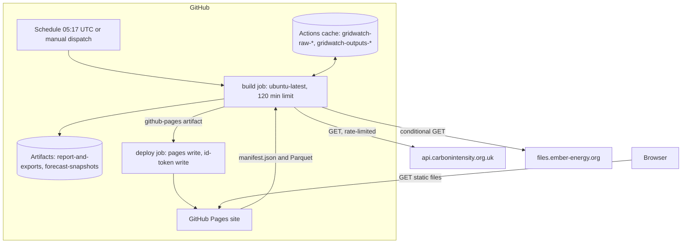
```mermaid
flowchart TB
    subgraph GH["GitHub"]
        SCHED["Schedule 05:17 UTC or manual dispatch"]
        BUILD["build job: ubuntu-latest, 120 min limit"]
        CACHE[("Actions cache: gridwatch-raw-*, gridwatch-outputs-*")]
        ART[("Artifacts: report-and-exports, forecast-snapshots")]
        DEPLOY["deploy job: pages write, id-token write"]
        PAGES["GitHub Pages site"]
    end
    CIAPI["api.carbonintensity.org.uk"]
    EMBER["files.ember-energy.org"]
    USER["Browser"]
    SCHED --> BUILD
    CACHE <--> BUILD
    BUILD --> ART
    BUILD -->|"GET, rate-limited"| CIAPI
    BUILD -->|"conditional GET"| EMBER
    PAGES -->|"manifest.json and Parquet"| BUILD
    BUILD -->|"github-pages artifact"| DEPLOY
    DEPLOY --> PAGES
    USER -->|"GET static files"| PAGES
```

- **On GitHub.** `.github/workflows/pipeline.yml` runs one build job and one deploy job.
  Raw data and model outputs live in the Actions cache between runs (23 MB and about 1 MB after
  the first run); the snapshot archive is also published on Pages and kept as a 90-day artifact.
  `.github/workflows/ci.yml` runs on pushes to `main` and on pull requests.
- **Locally.** The same commands run from a checkout (`uv run gridwatch ...`) with data under
  `GRIDWATCH_DATA_DIR` (default `data`); `site/index.html` opens from disk. An installed wheel
  carries the dbt project as `gridwatch/dbt_project`, so it works outside a checkout.
- **Published site layout** (relative to `https://fasharif.github.io/gridwatch/` once Pages is
  enabled): `index.html`; `assets/plotly.min.js`, `assets/style.css`, `assets/app.js`;
  `data/annual_grid_intensity.csv`; `data/forecast_snapshots/manifest.json` and
  `data/forecast_snapshots/YYYY/YYYY-MM.parquet`; `downloads/powerbi/*.csv` and
  `downloads/powerbi/manifest.json`; `dbt/index.html`; `.nojekyll`.

### 3.4 Key design decisions

The records in [docs/decisions.md](docs/decisions.md) are the source; one line each here.

| No. | Decision | In one line |
| ---: | --- | --- |
| 1 | [Python 3.12, uv and a lockfile](docs/decisions.md#1-python-312-uv-and-a-lockfile) | Target 3.12, commit `uv.lock`, install with `uv sync --locked` |
| 2 | [DuckDB with dbt-duckdb](docs/decisions.md#2-duckdb-with-dbt-duckdb-as-the-warehouse) | A single-file warehouse reading Parquet directly; one writer at a time |
| 3 | [Raw layer: monthly Parquet with idempotent upserts](docs/decisions.md#3-raw-layer-monthly-parquet-with-idempotent-upserts) | Rewrite a month only when a row changed; revisions overwrite |
| 4 | [Ember bulk CSV instead of the Ember API](docs/decisions.md#4-ember-bulk-csv-instead-of-the-ember-api) | No key; conditional GET; fail loudly on a missing column |
| 5 | [Work around the API's undocumented behaviour](docs/decisions.md#5-work-around-the-apis-undocumented-behaviour) | 30-minute shift, year-boundary split, chunk limits, polite retries, `--repair-gaps` |
| 6 | [Data quality](docs/decisions.md#6-data-quality-null-bad-values-flag-them-and-keep-them-countable) | Null and flag values outside 10 to 700 gCO2/kWh; known gaps in a seed |
| 7 | [Dimensional model keyed by UTC](docs/decisions.md#7-dimensional-model-keyed-by-utc-described-in-uk-local-time) | Gap-free UTC spine, UK local date and time keys |
| 8 | [A fixed, overridable reporting window](docs/decisions.md#8-a-fixed-overridable-reporting-window) | Last 12 complete months unless `--report-start`/`--report-end` |
| 9 | [scikit-learn gradient boosting](docs/decisions.md#9-forecast-with-scikit-learn-gradient-boosting) | One direct model for 96 horizons, predicting the change from the last value |
| 10 | [Baselines and the order of work](docs/decisions.md#10-evaluate-against-baselines-and-the-api-and-record-the-order-of-work) | Rolling-origin backtest; the test year is not a clean hold-out for the redesign |
| 11 | [Generated HTML with Plotly](docs/decisions.md#11-dashboard-generated-html-with-plotly) | Static page from Python, Plotly served from the site, autoescaped template |
| 12 | [History between scheduled runs](docs/decisions.md#12-keeping-history-between-scheduled-runs) | Actions cache for raw data; snapshots published with Pages and restored each run |
| 13 | [dbt in a child process](docs/decisions.md#13-dbt-runs-in-a-child-process) | Avoids a held DuckDB connection; dbt writes only under the data directory |
| 14 | [No network in tests and CI](docs/decisions.md#14-tests-and-ci-never-call-the-network) | Recorded cassette, fake API, pytest-socket |
| 15 | [Weekly backtest](docs/decisions.md#15-the-backtest-runs-weekly-in-the-daily-workflow) | Mondays, on request, or when no result is cached |
| 16 | [Power BI as a documented star schema](docs/decisions.md#16-power-bi-as-a-documented-star-schema-not-a-pbix) | CSVs, DAX and a guide; no `.pbix` claimed |
| 17 | [What data is committed](docs/decisions.md#17-what-data-is-committed) | Only the annual CSV, the Power BI snapshot and the test fixtures |
| 18 | [Pinned and checked actions](docs/decisions.md#18-pin-third-party-actions-to-a-commit-and-check-every-reference) | Third-party actions by SHA with a version comment; `scripts/check_action_refs.py` |
| 19 | [Uncertainty of headline results](docs/decisions.md#19-state-the-uncertainty-of-headline-results) | 7-day block bootstrap, Diebold-Mariano with Newey-West variance |
| 20 | [Numbers come from the pipeline](docs/decisions.md#20-numbers-in-the-prose-come-from-the-pipeline-and-are-reproducible) | A headline table in the report and a test that checks the prose against it |

## 4. Modules

| ID | Module | Code |
| --- | --- | --- |
| [M1](#m1-configuration) | Configuration | `src/gridwatch/config.py` |
| [M2](#m2-command-line-interface) | Command-line interface | `src/gridwatch/cli.py` |
| [M3](#m3-http-fetcher-and-cassettes) | HTTP fetcher and cassettes | `src/gridwatch/ingest/http.py`, `src/gridwatch/ingest/cassette.py` |
| [M4](#m4-carbon-intensity-api-client) | Carbon Intensity API client | `src/gridwatch/ingest/carbon_intensity.py` |
| [M5](#m5-ember-client) | Ember client | `src/gridwatch/ingest/ember.py` |
| [M6](#m6-raw-parquet-store) | Raw Parquet store | `src/gridwatch/ingest/storage.py` |
| [M7](#m7-ingestion-orchestrator) | Ingestion orchestrator | `src/gridwatch/ingest/pipeline.py` |
| [M8](#m8-snapshot-mirror) | Snapshot mirror | `src/gridwatch/ingest/snapshot_mirror.py` |
| [M9](#m9-transform-runner) | Transform runner | `src/gridwatch/transform.py` |
| [M10](#m10-dbt-warehouse) | dbt warehouse | `dbt/` |
| [M11](#m11-forecaster) | Forecaster | `src/gridwatch/forecast/data.py`, `calendar.py`, `features.py`, `model.py`, `service.py` |
| [M12](#m12-backtest) | Backtest | `src/gridwatch/forecast/backtest.py`, `baselines.py`, `metrics.py` |
| [M13](#m13-report-and-statistics) | Report and statistics | `src/gridwatch/report.py`, `src/gridwatch/stats.py` |
| [M14](#m14-exports-and-power-bi-pack) | Exports and Power BI pack | `src/gridwatch/export.py`, `powerbi/`, `exports/` |
| [M15](#m15-dashboard) | Dashboard | `src/gridwatch/dashboard/` |
| [M16](#m16-ci-workflow) | CI workflow | `.github/workflows/ci.yml`, `scripts/check_action_refs.py`, `.github/dependabot.yml` |
| [M17](#m17-daily-pipeline-workflow-and-hosting) | Daily pipeline workflow and hosting | `.github/workflows/pipeline.yml`, `scripts/ci_timed.sh` |
| [M18](#m18-test-suite-and-fixtures) | Test suite and fixtures | `tests/`, `scripts/record_fixtures.py` |
| [M19](#m19-maintenance-scripts) | Maintenance scripts | `scripts/generate_bank_holidays.py`, `scripts/screenshot.py`, `scripts/time_pipeline.py` |

### M1 Configuration

**Purpose.** Read every runtime setting from environment variables, apply documented defaults and
reject invalid values before any work starts.

**Requirements.** NFR-4, NFR-8; provides the start dates for FR-1 to FR-3 and the politeness
settings for NFR-2.

**Architecture.** One frozen dataclass, `Settings`, built by `Settings.from_env(env=None)`
(defaults to `os.environ`). The helpers `_date_setting`, `_int_setting`, `_float_setting` and
`_memory_setting` parse and range-check one variable each and raise `ConfigError` (a
`ValueError`). gridwatch reads the process environment only; it does not load `.env` files.

**Workflow.** `cli.main` parses the arguments, calls `Settings.from_env()` once and passes the
object to the command handler. dbt receives the values it needs from `transform.dbt_environment`.

**Components.** `Settings` with derived paths `raw_dir` (`<data_dir>/raw`), `warehouse_path`
(`<data_dir>/warehouse/gridwatch.duckdb`) and `outputs_dir` (`<data_dir>/outputs`); constants
`CARBON_INTENSITY_API`, `EMBER_YEARLY_CSV`, `USER_AGENT`, `NATIONAL_EARLIEST`,
`GENERATION_EARLIEST`, `REGIONAL_EARLIEST`, `MEMORY_SIZE`; `.env.example` lists every variable.

**APIs.**

| Variable | Default | Accepted |
| --- | --- | --- |
| `GRIDWATCH_DATA_DIR` | `data` | Any path; resolved to an absolute path |
| `GRIDWATCH_NATIONAL_START` | `2017-09-26` | ISO 8601, not before 2017-09-26 00:00 UTC |
| `GRIDWATCH_GENERATION_START` | `2018-05-10T23:30` | ISO 8601, not before 2018-05-10 23:30 UTC |
| `GRIDWATCH_REGIONAL_START` | `2023-01-01` | ISO 8601, not before 2018-05-10 23:30 UTC |
| `GRIDWATCH_REFETCH_DAYS` | `2` | Whole number, 0 to 31 |
| `GRIDWATCH_MIN_REQUEST_INTERVAL` | `1.0` | Number, 0 to 60 seconds |
| `GRIDWATCH_MAX_ATTEMPTS` | `5` | Whole number, 1 to 20 |
| `GRIDWATCH_HTTP_TIMEOUT` | `60` | Number, 1 to 600 seconds |
| `GRIDWATCH_DUCKDB_MEMORY` | `2GB` | A size such as `2GB`, `512MB`, `1.5GiB` (KB to TB, KiB to TiB) |

**Data flow.** Environment, then `Settings`, then the command handlers. Empty values fall back to
the default, except `GRIDWATCH_DATA_DIR`: an empty value resolves to the current directory. A
date without a time zone is taken as UTC.

**Database interaction.** None directly. It fixes the warehouse path and the DuckDB memory limit,
which reach the dbt profile as `GRIDWATCH_WAREHOUSE` and `GRIDWATCH_DUCKDB_MEMORY`.

**Frontend interaction.** Not applicable: the dashboard is built from the warehouse and has no
runtime settings.

**Backend interaction.** `ingest/http.py` uses `user_agent`, `timeout_s`,
`min_request_interval_s` and `max_attempts`; `ingest/pipeline.py` the start dates and
`refetch_days`; `transform.py` `data_dir`, `warehouse_path` and `duckdb_memory`.

**Authentication/authorization.** Not applicable: both sources are public, so there is no
credential to configure (`.env.example`: "No secrets are needed").

**Validation.** Messages, exactly as raised: `NAME='value' is not an ISO 8601 date such as
2024-01-01`; `NAME='value' is earlier than the first period the API serves (2017-09-26 00:00
UTC)`; `NAME='value' is not a whole number`; `NAME='value' is not a number`; `NAME=value must be
between MIN and MAX`; `NAME='value' is not a memory size such as 2GB, 512MB or 1.5GiB`.

**Error handling.** `ConfigError` reaches `cli.main`, which logs the message and returns exit
status 2 before the command runs.

**Testing.** `tests/test_cassette_and_config.py` (`test_defaults`, `test_overrides_are_parsed`,
`test_invalid_values_name_the_variable`, `test_dbt_gets_the_validated_memory_limit`);
`tests/test_cli.py::test_config_error_exits_with_status_2`.

**Deployment.** Part of the wheel. The workflows set `GRIDWATCH_DATA_DIR` (`data` in
`pipeline.yml`, `ci-data` in the fixture job of `ci.yml`); fixture runs take their settings from
`tests/fixtures/fixture.env`.

### M2 Command-line interface

**Purpose.** The single entry point (`gridwatch = "gridwatch.cli:main"`): parse arguments, build
the objects each step needs, run the step and turn errors into one-line messages and exit
statuses.

**Requirements.** NFR-3, NFR-8; the entry point for every functional requirement.

**Architecture.** `argparse` with one subparser per command, each bound to a `cmd_*` handler
through `set_defaults(func=...)`. `main(argv)` configures logging, builds `Settings` and
dispatches. The report, export and dashboard modules are imported inside their handlers;
`gridwatch.ingest.snapshot_mirror` is imported at the top of `cli.py` for `SnapshotMirrorError`,
and `restore_snapshots` inside `cmd_restore_snapshots`.

**Workflow.** Parse, then logging (`%(asctime)s %(levelname)s %(name)s: %(message)s` on stderr,
DEBUG with `-v`/`--verbose`, the `httpx` logger at WARNING), then `Settings.from_env()`, then
`args.func(args, settings)`, then the exit status.

**Components.** Handlers `cmd_ingest`, `cmd_transform`, `cmd_forecast`, `cmd_backtest`,
`cmd_report`, `cmd_export`, `cmd_site`, `cmd_docs`, `cmd_restore_snapshots`, `cmd_run`; helpers
`_parse_as_of`, `_iso_time`, `_iso_date`, `_int_between`, `_dbt_vars`, `_model_config`,
`_fetcher`, `_require_warehouse`; `UsageError`.

**APIs.** gridwatch exposes no HTTP API; the CLI is its interface.

| Command | Main options (default) | Writes |
| --- | --- | --- |
| `ingest` | `--source` (repeatable: national, generation, regional, snapshot, ember; default all), `--as-of`, `--repair-gaps`, `--replay DIR` or `--record DIR` | `data/raw/`; JSON ingest report on stdout |
| `transform` | `--as-of`, `--report-start`, `--report-end` | Warehouse |
| `forecast` | `--train-days` (730, 14 to 3650), `--calibration-days` (56, 0 to 365, capped at a fifth of `--train-days`) | `data/outputs/forecast_latest.parquet` |
| `backtest` | model options, `--test-days` (365), `--retrain-every` (28), `--until`, `--last-origin`, `--origin-hour` (0) | `data/outputs/backtest_*` |
| `report` | `--out` (`docs/generated/report.md`) | Markdown report |
| `export` | `--annual-csv` (`exports/annual_grid_intensity.csv`), `--powerbi-dir`, `--half-hourly-days` (365) | CSV files |
| `site` | `--out` (`site`), `--annual-csv` | Static site |
| `docs` | `--out` (`site/dbt`) | `index.html` of the dbt docs |
| `restore-snapshots` | `URL` (folder holding `manifest.json`) | `data/raw/carbon_intensity/forecast_snapshots/` |
| `run` | `--as-of`, `--replay`, `--skip-backtest`, `--test-days`, `--annual-csv`, `--powerbi-dir`, `--site-dir` (`site`), model options | Runs ingest, transform, forecast, backtest (unless skipped), export, docs and site; not `report` |

**Data flow.** `_dbt_vars` turns `--as-of`, `--report-start` and `--report-end` into the dbt
variables `as_of`, `report_start_date` and `report_end_date`. `_model_config` builds the
`ModelConfig` passed to the forecaster. `_fetcher` builds the HTTP fetcher, with no request
spacing when replaying a cassette.

**Database interaction.** `_require_warehouse` checks that the warehouse file exists before
`report`, `export` and `site`; the CLI runs no queries itself.

**Frontend interaction.** None directly; `site` and `docs` produce the frontend (M15, M9).

**Backend interaction.** Calls `ingest.pipeline.run_ingest`, `transform.run_dbt` and
`generate_docs`, `forecast.service.run_forecast` and `run_backtest_job`, `report.write_report`,
`export.export_annual_intensity` and `export_powerbi`, `dashboard.build.build_site` and
`ingest.snapshot_mirror.restore_snapshots`.

**Authentication/authorization.** Not applicable: a local command with no accounts; it acts with
the permissions of the user or runner that starts it.

**Validation.** argparse types reject bad values with exit status 2 and messages such as
`'yesterday' is not an ISO 8601 time`, `'2025-13-01' is not a date such as 2025-09-01`, `'lots'
is not a whole number` and `5 is not between 14 and 3650`. `--replay` and `--record` are mutually
exclusive. A reversed window raises `UsageError`: `--report-start 2026-01-01 is after
--report-end 2025-12-31`. A naive `--as-of` is taken as UTC.

**Error handling.**

| Raised | Logged as | Exit status |
| --- | --- | ---: |
| `ConfigError`, `UsageError`, `IngestError`, `CassetteMissError`, `SnapshotMirrorError`, `TransformError`, `SeriesError`, `NotEnoughHistoryError`, `argparse.ArgumentTypeError` | The message | 2 |
| Any other `ValueError`, `OSError` or `duckdb.Error` | `TypeName: message` (traceback only with `--verbose`) | 2 |
| argparse usage errors | Usage and the message on stderr | 2 |
| Anything else | Python traceback | 1 |

`run` stops at the first step that fails.

**Testing.** `tests/test_cli.py`: every command parses, invalid arguments, reversed window,
missing warehouse for `report`, `export` and `site`, a DuckDB error printed as one line, `run`
passing model settings to forecast and backtest, `restore-snapshots` on 404 and 403, and the
pinned `--last-origin`.

**Deployment.** Installed as a console script by the hatchling wheel; in a checkout,
`uv run gridwatch ...` from the repository folder (default paths are relative to it).

### M3 HTTP fetcher and cassettes

**Purpose.** One place for HTTP: request spacing, retries and `Retry-After`; plus recording and
replaying responses so tests and CI never touch the network.

**Requirements.** NFR-2, NFR-5, FR-20.

**Architecture.** `HttpFetcher` wraps an `httpx.Client` from `build_client` with a `RateLimiter`
and a `RetryPolicy`. Clock, sleep and random generator are injectable. The transport is
pluggable: the real one, `ReplayTransport` or `RecordingTransport`.

**Workflow.** For each attempt: `RateLimiter.wait()`, then `client.get`. A status below 400
(including 304) is returned. A transport error or a status in `RETRYABLE_STATUS` (408, 425, 429,
500, 502, 503, 504) waits `RetryPolicy.delay(attempt)`, a uniform draw between half and all of
`min(60, 2^(attempt - 1))` seconds, or longer when `Retry-After` asks for it (capped at 300
seconds), then retries. Any other status raises `FetchError` at once.

**Components.** `ingest/http.py`: `RateLimiter`, `RetryPolicy`, `retry_after_seconds`,
`HttpFetcher`, `FetchError`, `build_client`. `ingest/cassette.py`: `ReplayTransport`,
`RecordingTransport`, `CassetteMissError`, `body_name`, `KEPT_HEADERS` (content-type, etag,
last-modified, retry-after).

**APIs.** `HttpFetcher.get(url, headers=None) -> httpx.Response` and the counter
`request_count`. Every request carries `User-Agent: gridwatch/0.1
(+https://github.com/fasharif/gridwatch)` and `Accept: application/json, text/csv;q=0.9`;
redirects are followed. A cassette directory holds `index.json` (URL to status, kept headers and
body file) and gzip bodies named by the first 16 hex characters of the URL's SHA-256.

**Data flow.** URL to response. With a cassette: URL, then an exact lookup in `index.json`, then
the decompressed body.

**Database interaction.** Not applicable: network layer only.

**Frontend interaction.** Not applicable.

**Backend interaction.** Used by `ingest/pipeline.py`, `ingest/ember.py`,
`ingest/snapshot_mirror.py` and `scripts/record_fixtures.py`; built by `cli._fetcher`.

**Authentication/authorization.** Not applicable: no credential is sent, only a descriptive
User-Agent.

**Validation.** `RateLimiter` rejects a negative interval (`min_interval_s must not be
negative`); `retry_after_seconds` accepts seconds or an HTTP date and ignores anything else.

**Error handling.** `FetchError(url, reason, status)` with the message `GET <url> failed:
<reason>`, where the reason is `HTTP <status>: <first 200 characters of the body>` or `gave up
after <n> attempts (<last reason>)`. Each retry logs `attempt N/M for <url> failed (<reason>);
retrying in X.Xs`. A replay miss raises `CassetteMissError`: `no recording for <url>; re-record
with scripts/record_fixtures.py`; an empty cassette raises `no recordings found in <dir>`.

**Testing.** `tests/test_http.py` (spacing, capped jittered delays, `Retry-After` in seconds and
as a date, the cap, 4xx not retried, giving up, 304 returned);
`tests/test_cassette_and_config.py` (`test_record_then_replay`, `test_replay_miss_is_explicit`,
`test_empty_cassette_is_rejected`).

**Deployment.** Library code. The CI fixture job, the end-to-end test and the README quick start
replay `tests/fixtures/cassette`; [F14](#f14-re-recording-the-test-cassette) re-records it.

### M4 Carbon Intensity API client

**Purpose.** Encode the API's endpoints, range limits and undocumented behaviour, and parse its
responses into typed frames.

**Requirements.** FR-1, FR-2, FR-3, FR-4, FR-6.

**Architecture.** Pure functions with no I/O: request planning (`windows_to_fetch`,
`internal_gaps`, `merge_windows`, `chunk_window`, `year_split_point`, `plan_requests`,
`range_url`, `snapshot_url`) and parsing (`parse_national`, `parse_generation`, `parse_regional`,
`parse_snapshot`). `Window` is a half-open UTC interval, validated when created.

**Workflow.** Work out the windows to request from what is stored, split them into chunks within
the endpoint's limit that never cross a year boundary, build URLs shifted by 30 minutes, then
(after M7 has fetched them) parse each response, dropping half-hours outside the requested
window. The behaviour behind these rules is in
[data.md](docs/data.md#api-behaviour-gridwatch-relies-on).

**Components.** `Dataset` (`national_intensity`, `generation_mix`, `regional`,
`forecast_snapshots`), `MAX_WINDOW` (30, 30 and 13 days), the schemas `NATIONAL_SCHEMA`,
`GENERATION_SCHEMA`, `REGIONAL_INTENSITY_SCHEMA`, `REGIONAL_MIX_SCHEMA`, `SNAPSHOT_SCHEMA`, and
the exceptions `ApiError` and `ParseError`.

**APIs.** Consumed, all `GET` on `https://api.carbonintensity.org.uk`, times as
`YYYY-MM-DDTHH:MMZ`:

| Endpoint | Used for | Limit and handling |
| --- | --- | --- |
| `GET /intensity/{from}/{to}` | National forecast and actual | Ranges over 31 days rejected; 30-day chunks (`chunk_window` splits every dataset at the year boundary) |
| `GET /generation/{from}/{to}` | National generation mix | 31 days; 30-day chunks, split before 23:30 UTC on 31 December |
| `GET /regional/intensity/{from}/{to}` | Regional forecast and mix | 14 days or more rejected; 13-day chunks, split at the year |
| `GET /intensity/{issued}/fw48h` | The 48-hour forecast as issued | One request per run |

`from` is the window start plus 30 minutes and `to` the window end, because the API returns
half-hours by their end time; a one-half-hour window asks for one extra half-hour, which the
parser drops.

**Data flow.** JSON in, polars frames out, with naive UTC timestamps and `fetched_at_utc` on every
row.

**Database interaction.** Not applicable: it returns frames; M6 stores them.

**Frontend interaction.** Not applicable.

**Backend interaction.** Called by `ingest/pipeline.py`.

**Authentication/authorization.** Not applicable: the API is public and needs no key.

**Validation.** `Window` rejects naive bounds (`window bounds must be timezone-aware`), bounds off
the half-hour and an end not after the start. Parsing requires a JSON object with a `data` list,
periods of exactly 30 minutes, whole numbers or null for intensities, an intensity index in
{very low, low, moderate, high, very high}, a string fuel and numeric share in every mix entry,
and an id and intensity object for every region.

**Error handling.** A payload with an `error` key raises `ApiError("API returned an error:
<message>")`. Structural problems raise `ParseError` naming the field, for example `response has
no 'data' list` or `unknown intensity index 'x'`. M7 wraps both in `IngestError`.

**Testing.** `tests/test_carbon_intensity.py` (chunking and the new-year split, the URL shift,
the widened single half-hour, recorded responses for all four endpoints, error documents,
malformed records, window planning, gaps and merging). `tests/fakes.py` (`FakeCarbonApi`)
reproduces the end-time semantics, range limits and year truncation.

**Deployment.** Library code. If the API changes format, re-record the cassette with
`scripts/record_fixtures.py` ([F14](#f14-re-recording-the-test-cassette)).

### M5 Ember client

**Purpose.** Download Ember's yearly bulk CSV only when it changes and store it as Parquet with
checked columns.

**Requirements.** FR-5, NFR-4, NFR-12.

**Architecture.** A conditional GET driven by a manifest of the last download, a SHA-256 check
that avoids rewriting identical content, and a strict mapping of 12 source columns
(`EMBER_COLUMNS`). The fallback to the stored copy lives in M7 (`ingest_ember`).

**Workflow.** Load `manifest.json`; if it exists, the Parquet file exists and the URL matches,
send `If-None-Match` and `If-Modified-Since`. On 304, return `not-modified`. Otherwise hash the
body; an unchanged hash also returns `not-modified`. A new body is parsed, written with
`write_single` and recorded in a new manifest; the result is `downloaded`.

**Components.** `EMBER_COLUMNS`, `EmberManifest` (url, etag, last_modified, sha256, rows,
fetched_at_utc), `EmberResult` (status `downloaded`, `not-modified` or `failed-kept-previous`),
`previous_download`, `parse_yearly_csv`, `ingest_ember_yearly`, `EmberFormatError`.

**APIs.** Consumed: `GET
https://files.ember-energy.org/public-downloads/generation/outputs/release_generation_yearly_global.csv`.

**Data flow.** CSV, then trimmed strings with empty cells as null, then strict casts, then rows
sorted by area, year and source, then
`data/raw/ember/yearly_electricity/yearly_electricity.parquet` and `manifest.json`.

**Database interaction.** Writes the file behind the dbt source `ember.yearly_electricity`.

**Frontend interaction.** Indirect: the country charts read marts built from this file.

**Backend interaction.** Called by `ingest/pipeline.py`; `report.py` reads the manifest through
`previous_download` to state which Ember file the report used.

**Authentication/authorization.** Not applicable: the bulk file is public; the Ember API, which
needs a key, is deliberately not used ([decision 4](docs/decisions.md#4-ember-bulk-csv-instead-of-the-ember-api)).

**Validation.** `EmberFormatError` with: `could not read the Ember CSV: ...`, `Ember CSV is
missing expected columns: [...]`, `Ember CSV has a value of the wrong type: ...`, `Ember CSV has
no rows`, `Ember CSV has rows without an area or year`.

**Error handling.** See [F4](#f4-ember-yearly-download): with a stored copy, a failure becomes a
warning and status `failed-kept-previous`; without one, the run stops.

**Testing.** `tests/test_ember.py` (recorded CSV, missing column, wrong type, empty file,
conditional download, unchanged content without an ETag, failure keeping the previous file,
first download failing).

**Deployment.** Library code; the daily run downloads the 16 MB file only when Ember publishes a
new version.

### M6 Raw Parquet store

**Purpose.** Keep raw data as monthly Parquet files with idempotent, atomic upserts.

**Requirements.** NFR-1; storage for FR-1 to FR-6.

**Architecture.** `ParquetStore(root, schema, key_columns, time_column)` stores one file per
calendar month of the time column, `<root>/<YYYY>/<YYYY-MM>.parquet` (zstd, with statistics).
`fetched_at_utc` is metadata and does not count as a change.

**Workflow.** `upsert(frame)`: conform the columns to the schema with strict casts, reject null
keys, keep the last row per key, split by month, and for each month join with the existing file.
New keys are inserts, changed value columns are updates; if neither occurs the file is not
touched. Otherwise the merged month is written to `<file>.parquet.tmp` and renamed over the
original, and the dataset's placeholder is removed.

**Components.** `ParquetStore`, `UpsertStats` (inserted, updated, unchanged, files_written),
`SchemaMismatchError`, `write_placeholder`, `write_single`, `_atomic_write`, `PLACEHOLDER`
(`empty/empty.parquet`), `METADATA_COLUMNS`.

**APIs.** `files()`, `read()`, `time_bounds()`, `distinct_times()`, `distinct_times_by(column)`,
`upsert(frame) -> UpsertStats`; module functions `write_placeholder(store)` and
`write_single(frame, path)`.

**Data flow.** Frames from M4, M5 and M8 in; files out; dbt and the store's own reads glob
`*/*.parquet`.

**Database interaction.** This is the raw zone, not the DuckDB warehouse. The stores under
`data/raw/carbon_intensity/`:

| Directory | Key | Partitioned by |
| --- | --- | --- |
| `national_intensity` | `period_start_utc` | `period_start_utc` month |
| `generation_mix` | `period_start_utc`, `fuel` | `period_start_utc` month |
| `regional_intensity` | `period_start_utc`, `region_id` | `period_start_utc` month |
| `regional_generation_mix` | `period_start_utc`, `region_id`, `fuel` | `period_start_utc` month |
| `forecast_snapshots` | `issued_at_utc`, `period_start_utc` | `issued_at_utc` month |

dbt reads them through `read_parquet('<GRIDWATCH_DATA_DIR>/raw/carbon_intensity/{name}/*/*.parquet')`.

**Frontend interaction.** Not applicable.

**Backend interaction.** Written by M7 and M8; the store factories live in
`ingest/pipeline.py`; M8 also reads the snapshot files to publish them.

**Authentication/authorization.** Not applicable: local files, governed by file-system
permissions.

**Validation.** `SchemaMismatchError`: `columns differ from the <name> schema (missing: [...],
unexpected: [...])` and `<n> incoming rows have a null key`; strict casts reject wrong types; the
constructor rejects key or time columns that are not in the schema.

**Error handling.** A crash mid-write leaves the previous month file intact; a stray
`.parquet.tmp` does not match `*/*.parquet`, so readers ignore it.

**Testing.** `tests/test_storage.py` (one file per month, repeat upsert is a no-op, changed and
null-to-value updates, last duplicate wins, bounds, schema and null-key rejection, placeholder
removal); `tests/test_pipeline.py::test_first_run_then_idempotent_rerun` checks byte-for-byte
stability.

**Deployment.** Files live under `GRIDWATCH_DATA_DIR/raw`; the daily workflow caches the folder
as `gridwatch-raw-<run_id>-<run_attempt>`.

### M7 Ingestion orchestrator

**Purpose.** Decide what to fetch for each source, fetch it, store it, and report what happened.

**Requirements.** FR-1 to FR-6, NFR-1.

**Architecture.** `run_ingest` dispatches each selected source in turn: `ingest_national`,
`ingest_generation` and `ingest_regional` share `_ingest_ranges`; `ingest_snapshot` and
`ingest_ember` handle the other two. Store factories (`national_store`, `generation_store`,
`regional_intensity_store`, `regional_mix_store`, `snapshot_store`) fix each dataset's key and
partitioning.

**Workflow.** See [F2](#f2-incremental-ingestion-of-gb-data), [F3](#f3-forecast-snapshot-capture-and-archive),
[F4](#f4-ember-yearly-download) and, for `--repair-gaps`, [F15](#f15-gap-repair-runbook). Sources run in the order given (default `ALL_SOURCES`:
national, generation, regional, snapshot, ember); the first failure stops the remaining sources.

**Components.** `ALL_SOURCES`, `SNAPSHOT_MAX_LAG` (30 minutes), `DatasetReport`, `IngestReport`,
`IngestError`, `stored_gaps`, `ensure_empty_datasets`, `_json`.

**APIs.** `run_ingest(settings, fetcher, now, sources=ALL_SOURCES, repair_gaps=False,
allow_past_snapshot=False) -> IngestReport`. `gridwatch ingest` prints `IngestReport.to_json()`:
`as_of_utc`, `datasets` (each with `dataset`, `requests`, `windows`, `inserted`, `updated`,
`unchanged`, `files_written`) and `ember` (`status`, `rows`, `sha256`, `error`).

**Data flow.** Stored time bounds and settings, then planned windows, then HTTP, then parsed
frames, then upserts, then counts.

**Database interaction.** Raw zone only (M6). `ensure_empty_datasets` writes an empty
`empty/empty.parquet` for any dataset with no files, so every dbt source resolves.

**Frontend interaction.** Not applicable.

**Backend interaction.** Uses M3, M4, M5 and M6; called by `cli.cmd_ingest` and
`scripts/record_fixtures.py`.

**Authentication/authorization.** Not applicable: public sources.

**Validation.** `now must be timezone-aware`; `unknown source(s) [...]; choose from [...]`; the
snapshot is skipped when `now` is more than 30 minutes behind the clock unless
`allow_past_snapshot` is set (only `--replay` and `scripts/record_fixtures.py` set it).

**Error handling.** `IngestError`: `<dataset>: request <k> of <n> failed (<cause>). Rows from the
<k-1> earlier request(s) are saved; rerun to resume.`; `forecast_snapshots: <cause>`; `ember:
<cause>. No earlier Ember file is stored.`

**Testing.** `tests/test_pipeline.py` (first run then idempotent rerun, incremental window, year
boundary, failure and resume, `--repair-gaps` asking only for the holes, a gap in one region,
past and current `--as-of` for the snapshot, unknown sources, replaying the recorded cassette,
placeholders, report serialisation).

**Deployment.** Run by `gridwatch ingest` and `gridwatch run`, and by the daily workflow's
*Ingest new data* step (with `--repair-gaps` when the `repair_gaps` input is ticked).

### M8 Snapshot mirror

**Purpose.** Keep the API's forecast snapshots, which cannot be fetched again, somewhere more
durable than the Actions cache: publish them with the dashboard and merge them back before each
run.

**Requirements.** FR-7, NFR-9, NFR-12.

**Architecture.** Two functions over the snapshot store: `publish_snapshots` (local store to a
folder with a manifest) and `restore_snapshots` (published folder to the local store, through
the same idempotent upsert). Integrity rests on a SHA-256 per file and a strict file-name
pattern, `FILE_PATTERN` = `^\d{4}/\d{4}-\d{2}\.parquet$`.

**Workflow.** See [F3](#f3-forecast-snapshot-capture-and-archive).

**Components.** `publish_snapshots`, `restore_snapshots`, `RestoreResult` (status `restored` or
`no-mirror`, files, stats), `SnapshotMirrorError`, `MANIFEST` (`manifest.json`), `ATTRIBUTION`.

**APIs.** Published: `GET <site>/data/forecast_snapshots/manifest.json` with `dataset`, `source`,
`generated_at_utc`, `rows` and `files` (`path`, `rows`, `sha256`), and `GET
<site>/data/forecast_snapshots/<YYYY>/<YYYY-MM>.parquet`. Consumed by `gridwatch
restore-snapshots URL`, which prints `<status>: <n> file(s), <n> new row(s), <n> unchanged`.

**Data flow.** Snapshot store, then `site/data/forecast_snapshots/`, then Pages; on the next run
Pages, then the snapshot store.

**Database interaction.** Raw zone only; the warehouse sees the snapshots through
`stg_carbon_intensity__forecast_snapshots`.

**Frontend interaction.** The dashboard links the manifest under *Downloads* when it exists.

**Backend interaction.** `dashboard/build.py` calls `publish_snapshots` before rendering;
`cli.cmd_restore_snapshots` calls `restore_snapshots` with a rate-limited fetcher.

**Authentication/authorization.** Reads are anonymous over HTTPS. Writing the archive is only
possible through the deploy job's `pages: write` permission (M17). A 403 from the site is an
error, not "nothing published".

**Validation.** Manifest must be JSON with a `files` list of objects; each path must match
`FILE_PATTERN` (no other folders, no `..`); each body must match its SHA-256; each file must be
readable Parquet that fits the snapshot schema. Publishing skips the empty placeholder, which
`restore_snapshots` would reject.

**Error handling.** HTTP 404 on the manifest returns `no-mirror`. Everything else raises
`SnapshotMirrorError`: `could not read the snapshot manifest: ...`, `<url>manifest.json is not a
snapshot manifest`, `unexpected entry in the manifest: ...`, `unexpected file name in the
manifest: ...`, `could not download <path>: ...`, `<path> does not match the SHA-256 in the
manifest`, `<path> is not a snapshot file: ...`.

**Testing.** `tests/test_snapshot_mirror.py` (manifest contents, nothing to publish, placeholder
never published, restore into an empty store then idempotent, local snapshots kept, 404,
corrupted file, unavailable site, bad manifest); `tests/test_cli.py::test_restore_snapshots_command`.

**Deployment.** The daily workflow restores from `SNAPSHOT_MIRROR_URL` (repository variable) or
`https://<owner>.github.io/<repository>/data/forecast_snapshots/`, publishes through `gridwatch
site`, and keeps a second copy as the `forecast-snapshots` artifact for 90 days.

### M9 Transform runner

**Purpose.** Run dbt against the raw data in a child process and turn its results into log lines
and a pass or fail.

**Requirements.** FR-8, FR-15, NFR-14.

**Architecture.** `run_dbt` starts `python -m dbt.cli.main` with the project from `_project_dir()`
(the packaged `gridwatch/dbt_project` if present, otherwise `dbt/` in the checkout), target and
log paths under the data directory, and reads `run_results.json`.
([decision 13](docs/decisions.md#13-dbt-runs-in-a-child-process)).

**Workflow.** See [F5](#f5-warehouse-build-and-quality-gate) for the build and
[F13](#f13-dbt-docs-build-and-publication) for the docs.

**Components.** `PROJECT_DIR`, `FAILED` (statuses `error`, `fail`, `runtime error`),
`TransformResult` (`success`, `results`, `failures`, `warnings`), `TransformError`,
`dbt_environment`, `check_inputs`, `parse_run_results`, `run_dbt`, `generate_docs`.

**APIs.** `run_dbt(settings, command=("build",), variables=None, project_dir=PROJECT_DIR) ->
TransformResult`; `generate_docs(settings, out_dir, project_dir=PROJECT_DIR) -> Path`.
Environment passed to dbt: `GRIDWATCH_DATA_DIR`, `GRIDWATCH_WAREHOUSE`,
`GRIDWATCH_DUCKDB_MEMORY`, `DBT_SEND_ANONYMOUS_USAGE_STATS=false`.

**Data flow.** Settings and variables in; `data/dbt-target/run_results.json` back; for docs,
`data/dbt-target/static_index.html` copied to `<out>/index.html`.

**Database interaction.** dbt opens the warehouse read-write through `dbt/profiles.yml`; this
process holds no DuckDB connection.

**Frontend interaction.** `generate_docs` produces the dbt docs page linked from the dashboard
footer.

**Backend interaction.** Called by `cmd_transform` and `cmd_docs`; runs M10.

**Authentication/authorization.** Not applicable: local process.

**Validation.** `check_inputs` requires the Ember Parquet file and the national-intensity folder;
`generate_docs` requires the warehouse, and also runs `check_inputs` through `run_dbt`, so
`gridwatch docs` needs the raw inputs as well as the warehouse. (`cmd_transform` calls
`ensure_empty_datasets` first, which creates the national folder with a placeholder, so for
`transform` the check in practice catches a missing Ember file.)

**Error handling.** `TransformError` with one of these messages:
``raw data not found: <paths>. Run `gridwatch ingest` first.``;
`dbt <command> exited with code <n>` when dbt wrote no results and exited with a non-zero code;
`dbt build failed (<n> node(s))` from `cmd_transform`, after it has logged
`dbt failure: <node> (<message>)` for each failing node;
``no warehouse at <path>; run `gridwatch transform` first``;
`dbt docs generate failed; see the dbt log above`.

**Testing.** `tests/test_cli.py` (`test_transform_without_data_explains_what_to_do`,
`test_check_inputs`); `tests/test_cassette_and_config.py::test_dbt_gets_the_validated_memory_limit`;
the full build in `tests/test_end_to_end.py`.

**Deployment.** The dbt project is force-included in the wheel (`pyproject.toml`), so an
installed `gridwatch` can build the warehouse outside a checkout.

### M10 dbt warehouse

**Purpose.** Turn raw Parquet into a tested dimensional model and one reporting table per
business question.

**Requirements.** FR-8, FR-9, NFR-3, NFR-6; feeds FR-10 to FR-17.

**Architecture.**

| Layer | Schema | Materialised | Models |
| --- | --- | --- | --- |
| Seeds | `reference` | Table | `gb_regions`, `fuels`, `countries`, `uk_bank_holidays`, `known_source_gaps` |
| Staging | `staging` | View | `stg_carbon_intensity__national_intensity`, `__generation_mix`, `__regional_intensity`, `__regional_generation_mix`, `__forecast_snapshots`; `stg_ember__yearly_electricity` |
| Intermediate | `intermediate` | Table | `int_national_half_hours` (gap-free spine, UK local keys, implausible values nulled and flagged), `int_generation_mix_wide`, `int_regional_half_hours`, `int_ember_country_year`, `int_batch_job_windows` |
| Marts | `marts` | Table | Dimensions `dim_date`, `dim_time_of_day`, `dim_region`, `dim_fuel`, `dim_country`; facts `fct_national_intensity`, `fct_generation_mix`, `fct_regional_intensity`, `fct_regional_generation_mix_daily`, `fct_api_forecast_snapshots`, `fct_country_electricity_annual`, `fct_country_intensity_annual` |
| Reporting | `reporting` | Table | (a) `rpt_batch_job_start_slots`, `rpt_batch_job_week_slots`, `rpt_batch_job_daily_strategies`, `rpt_batch_job_savings`; (b) `rpt_country_intensity_trend`, `rpt_country_intensity_comparison`, `rpt_annual_grid_intensity_export`; (c) `rpt_gb_annual_intensity`, `rpt_gb_monthly_intensity`, `rpt_gb_seasonal_profile`, `rpt_gb_seasonal_summary`, `rpt_gb_weekly_profile`, `rpt_gb_regional_intensity`; (d) `rpt_api_forecast_accuracy`, `rpt_api_forecast_snapshot_accuracy`; window `rpt_report_window` |

The macro `generate_schema_name` uses each configured schema name as it is.

**Workflow.** `dbt build` loads seeds, creates staging views over `read_parquet`, builds the
intermediate, mart and reporting tables in dependency order, and runs data tests and unit tests
as their models complete.

**Components.** Macros in `dbt/macros/time.sql` (`to_uk_local`, `half_hour_slot`, `as_of`,
`season`) and `generate_schema_name.sql`; generic tests in `dbt/tests/generic/`
(`accepted_range`, `aligned_to_half_hour`, `no_half_hour_gaps`, `recency_within_hours`,
`shares_sum_to_100`, `unique_combination_of_columns`); singular tests in `dbt/tests/`
(`assert_bank_holidays_cover_next_year` (warn), `assert_bank_holidays_cover_the_calendar`,
`assert_compared_countries_are_current`, `assert_ember_intensity_matches_emissions`,
`assert_oracle_is_never_beaten`, `assert_report_window_is_valid`); unit tests in
`_intermediate__unit_tests.yml` and `_reporting__unit_tests.yml`; exposures in
`dbt/models/exposures.yml` (`gridwatch_dashboard`, `annual_grid_intensity_csv`,
`powerbi_star_schema`, `intensity_forecast`).

**APIs.** The contract with the Python side is the set of tables it queries:
`marts.fct_national_intensity` (forecast, dashboard, report, export), `marts.dim_date`,
`marts.fct_api_forecast_snapshots` (dashboard), the other marts in the Power BI export, and the
`reporting.rpt_*` tables (dashboard, report, annual export). dbt variables in
`dbt/dbt_project.yml`: `as_of` (null), `report_start_date` and `report_end_date` (null: last 12
complete months), `batch_job_hours` (4), `batch_job_kw` (100), `profile_lookback_days` (28),
`plausible_min_gco2_kwh` (10), `plausible_max_gco2_kwh` (700), `recency_max_hours` (36).

**Data flow.** Raw Parquet and seeds, then staging, intermediate, marts and reporting. Facts are
keyed by UTC period start, with `date_key` and `time_key` pointing to UK local dimensions
([decision 7](docs/decisions.md#7-dimensional-model-keyed-by-utc-described-in-uk-local-time)).

**Database interaction.** DuckDB file `data/warehouse/gridwatch.duckdb` via `dbt/profiles.yml`
(target `local`, 4 threads, `TimeZone: UTC`, `memory_limit` from `GRIDWATCH_DUCKDB_MEMORY`).
dbt is the only writer; every Python reader opens the file with `read_only=True`. DuckDB allows
one writing process or several reading processes at a time.

**Frontend interaction.** The `gridwatch_dashboard` exposure lists the 13 models the dashboard
reads; the dbt docs show the lineage on the published site.

**Backend interaction.** Run by M9; read by M11, M12, M13, M14 and M15.

**Authentication/authorization.** Not applicable: a local file with no users or roles.

**Validation.** Tests are errors by default (`data_tests: +severity: error`). Notable gates:
`no_half_hour_gaps` (fails on any gap not listed in `known_source_gaps`; regional per
`region_id`), `recency_within_hours` (newest national half-hour within 36 hours of `as_of` or
the clock), `accepted_range` on national and snapshot intensity (10 to 700 gCO2/kWh; warn above
0 rows, error above 100; the regional forecast range test (0 to 1000, error on any row) and the
Ember range tests have their own thresholds), `shares_sum_to_100`, relationships to dimensions, and the singular tests above. Details and
counts are in [data.md](docs/data.md#data-quality).

**Error handling.** A failing error-level test fails `dbt build`, which makes `gridwatch
transform` exit with status 2; the daily workflow then stops before the deploy, so the dashboard
keeps the last good build ([runbook](docs/data.md#when-the-gap-test-fails),
[F15](#f15-gap-repair-runbook)). Warn-level results
are logged as `dbt warning: <node> (<message>)`.

**Testing.** The README counts 161 data tests and 5 unit tests (unit tests:
`national_spine_fills_gaps_and_removes_implausible_values`, `national_spine_uses_uk_summer_time`,
`batch_job_windows_need_complete_data`, `savings_compare_rules_over_the_same_days`,
`scheduling_rules_break_ties_by_the_earliest_start`). The whole build runs in
`tests/test_end_to_end.py` and in CI on the cassette; the first live run (3 October 2026) built
214 nodes with 4 warnings.

**Deployment.** Packaged in the wheel; the docs are published under `site/dbt/` by `gridwatch
docs`.

### M11 Forecaster

**Purpose.** Forecast GB national intensity for the 96 half-hours after the last known actual,
with a 10-90% interval.

**Requirements.** FR-10; method in [docs/forecast.md](docs/forecast.md).

**Architecture.** One direct `HistGradientBoostingRegressor` for all horizons, predicting the
change from the last known value with horizon-weighted rows, plus two quantile models (0.1 and
0.9) widened by conformal calibration per 6-hour band of lead time.

**Workflow.** See [F6](#f6-48-hour-forecast).

**Components.** `forecast/data.py`: `NationalSeries` (`timestamp`, `index_of`, `truncate`,
`last_actual_index`, `from_frame`), `load_national_series`, `SeriesError`.
`forecast/calendar.py`: `uk_bank_holidays` (England and Wales, `holidays` package),
`CalendarArrays`, `calendar_for`. `forecast/features.py`: `PERIODS_PER_DAY` (48),
`PERIODS_PER_WEEK`, `MAX_HORIZON` (96), `BASE_FEATURES` (18), `RELATIVE_TO_LAST` (9),
`FEATURE_NAMES` (27), `TrailingStats`, `latest_same_slot_offset`, `build_features`.
`forecast/model.py`: `ModelConfig`, `IntensityForecaster` (`training_origins`, `fit`,
`predict`), `Forecast`, `horizon_weights`, `lead_band`, `NotEnoughHistoryError`.
`forecast/service.py`: `forecast_next`, `run_forecast`, `FORECAST_FILE`.

**APIs.** `run_forecast(settings, config=None) -> polars.DataFrame` writing
`data/outputs/forecast_latest.parquet` with columns `issued_at_utc`, `period_start_utc`,
`horizon`, `forecast_gco2_kwh`, `p10_gco2_kwh`, `p90_gco2_kwh`. `ModelConfig` defaults:
`train_days` 730, `origin_step` 12, `max_iter` 300, `learning_rate` 0.05, `max_leaf_nodes` 31,
`min_samples_leaf` 50, `l2_regularization` 1.0, `quantiles` (0.1, 0.9), `calibration_days` 56,
`random_state` 42.

**Data flow.** `marts.fct_national_intensity` (`period_start_utc`, `actual_gco2_kwh`,
`forecast_gco2_kwh`) to a NaN-padded half-hourly array, to features, to models, to the
forecast file.

**Database interaction.** `load_national_series` opens the warehouse read-only and selects the
three columns ordered by time.

**Frontend interaction.** The dashboard's *The last two days and the next two* chart draws the
forecast and its range, and its subtitle gives the issue time.

**Backend interaction.** Called by `cmd_forecast`; `IntensityForecaster` is reused by M12.

**Authentication/authorization.** Not applicable.

**Validation.** `NationalSeries` requires a time-zone-aware start, equal-length arrays and a
regular half-hourly grid. `ModelConfig` rejects `train_days` below 14 (`train_days must be at
least 14`), `origin_step` below 1, quantiles outside 0 < low < high < 1 and `calibration_days`
outside `[0, train_days)`. `build_features` rejects horizons outside 1 to 96, origins outside
the series and a calendar that is too short. `tests/test_features.py` checks that no feature
uses a value after the origin.

**Error handling.** `SeriesError`:
``<warehouse> does not exist; run `gridwatch transform` first``,
`the national series is empty`,
`the national series has gaps or duplicates; rebuild the marts`,
`the series has no actual values`. `NotEnoughHistoryError`: `need more than <n> periods
before the cutoff`, `only <n> usable training rows`. When `calibration_days` is 0, or the
split leaves fewer than 1,000 fitting rows or 200 calibration rows, the quantile models are
fitted on all rows and the interval is not widened. `predict` before `fit` raises `RuntimeError`.

**Testing.** `tests/test_features.py` (no look-ahead, matrix shape and order, latest known day,
causal trailing statistics, UK local calendar and bank holidays, naive baselines);
`tests/test_model_and_backtest.py` (daily cycle learnt, first hours as good as persistence,
horizon weights, 6-hour bands, calibration per band, fit ignores later values, not enough
history, configuration validation, `forecast_next` starting after the last actual, series
checks).

**Deployment.** Runs daily in the workflow; the output persists in the `gridwatch-outputs-*`
cache.

### M12 Backtest

**Purpose.** Measure the forecaster over a year of daily forecasts against simple baselines and
the API, on a common sample, and keep validation runs separate from the main test.

**Requirements.** FR-11, NFR-3; feeds FR-12.

**Architecture.** Rolling origin: one forecast a day at `origin_hour_utc`, the model retrained
every `retrain_every_days` origins on data before the first origin of the block. All methods are
scored only where every method has a value (`complete_pairs`).

**Workflow.** See [F7](#f7-backtest-and-validation-runs).

**Components.** `forecast/backtest.py`: `METHODS` (model, persistence, naive_yesterday,
naive_last_week, api_forecast), `HORIZON_BANDS` (0-24 h, 24-48 h, 0-48 h), `LEAD_BANDS` (0-1,
1-4, 4-12, 12-24, 24-36, 36-48 h), `BacktestConfig`, `BacktestResult`, `origin_indices`,
`run_backtest`, `summarise`, `interval_coverage`, `lead_time_breakdown`, `monthly_breakdown`,
`win_rates`. `forecast/baselines.py`: `persistence`, `naive_same_slot_yesterday`,
`naive_same_slot_last_week`. `forecast/metrics.py`: `score`, `ErrorMetrics` (n, MAE, RMSE, MAPE
skipping non-positive actuals, bias). `forecast/service.py`: `run_backtest_job`, `summary_json`,
`validation_suffix`, `validation_summaries`.

**APIs.** `run_backtest_job(settings, config, until=None)` writes
`backtest_predictions.parquet` and `backtest_summary.json`, or with `--until` the suffixed
`backtest_predictions_until_<YYYYMMDD>_train<n>_cal<n>.parquet` and
`backtest_summary_until_...json`. Summary keys: `generated_at_utc`, `first_origin_utc`,
`last_origin_utc`, `origins`, `folds`, `config`, `metrics`, `interval_coverage`,
`mae_by_lead`, `monthly_mae_24_48h`, `model_win_rates_24_48h`, `until_utc`.

**Data flow.** National series from the warehouse, then per-origin predictions, then metric
tables, then the two output files.

**Database interaction.** Read-only, through `load_national_series`.

**Frontend interaction.** The *Forecast accuracy by lead time* chart and the *Model error, 24-48
h ahead* tile read the main backtest files; without them the chart shows "Backtest not run yet."

**Backend interaction.** Called by `cmd_backtest` and `cmd_run`; outputs read by M13 and M15.

**Authentication/authorization.** Not applicable.

**Validation.** `BacktestConfig` requires positive `test_days` and `retrain_every_days` and an
hour from 0 to 23. A pinned `--last-origin` is rounded down to the latest daily issue time (at
`--origin-hour`) at or before it, and that issue time must have its 48 hours of targets within
the data.

**Error handling.** `ValueError`: `no complete 48-hour test for a forecast issued at <time> UTC;
the latest issue time the data allows is <time>` and `not enough data for a single backtest
origin`; `SeriesError`: `no data before <time>` for an `--until` before the data. The CLI prints
these as one line with exit status 2.

**Testing.** `tests/test_model_and_backtest.py` (metrics, synthetic backtest, pinned last origin,
origins leaving room for targets, common sample, truncation, validation runs keeping separate
files); `tests/test_end_to_end.py::test_backtest_outputs`.

**Deployment.** In the daily workflow on Mondays, on request (`backtest` input), or when no
cached summary exists ([decision 15](docs/decisions.md#15-the-backtest-runs-weekly-in-the-daily-workflow));
the published validation runs were made by hand with the commands in
[forecast.md](docs/forecast.md#model).

### M13 Report and statistics

**Purpose.** Write the tables behind the findings, compute every derived figure the prose
quotes, and state the uncertainty of the headline results.

**Requirements.** FR-12, FR-13, NFR-7; FR-21 when the snapshot table matures.

**Architecture.** `report.build_report` queries the warehouse read-only, reads the backtest
outputs and the Ember manifest, calls `stats.py`, and returns one Markdown document. `stats.py`
is a pure numpy library.

**Workflow.** See [F8](#f8-report-and-the-docs-number-check).

**Components.** `report.py`: `build_report`, `write_report`, `markdown_table`,
`_saving_intervals`, `_diebold_mariano_table`, `_backtest_section`, `_lead_time_section`,
`_validation_section`, `_excluded_days_section`, `_forecast_headline`, constants `DM_LAGS` (7),
`BOOTSTRAP_BLOCK_DAYS` (7), `BOOTSTRAP_RESAMPLES` (2000), `SOFTWARE`. `stats.py`:
`moving_block_indices`, `saving_interval`, `newey_west_variance`, `diebold_mariano`, `Interval`,
`DieboldMariano`, `BOOTSTRAP_SEED` (20260925).

**APIs.** `write_report(warehouse, outputs_dir, target, raw_dir=None) -> Path`; report sections
*Data and software*, *Headline figures*, (a) to (d), *Forecast backtest* and *Validation runs*.

**Data flow.** Reporting and mart tables, backtest summaries and predictions, Ember manifest, then
the Markdown file (`docs/generated/report.md` by default; `site-extra/report.md` in the daily
workflow, uploaded as an artifact).

**Database interaction.** One read-only connection; queries `reporting.rpt_*` tables and
`marts.fct_national_intensity`, `marts.fct_country_intensity_annual`, `marts.dim_date` and
`marts.dim_time_of_day`.

**Frontend interaction.** Not applicable: the report is Markdown in the repository and an
artifact, not part of the site.

**Backend interaction.** Called by `cmd_report`; uses `forecast.service.validation_summaries`
and `ingest.ember.previous_download`.

**Authentication/authorization.** Not applicable.

**Validation.** `markdown_table` needs one header per column; `stats` functions reject empty,
non-finite or mismatched arrays, bad block lengths and levels, and too few periods for the lags
(`need at least <lags + 2> periods for <lags> lags`).

**Error handling.**

- A window that is too short for the batch-job analysis does not reach the intended message.
  `build_report` has a guard that raises `ValueError: the report window has too few complete
  days for the batch-job analysis; widen it with --report-start and --report-end`, but the
  `profile_overall` query before it ends in `.row(0, named=True)`. When no day in the window has
  every rule scored (`profile_guided` and `forecast_guided` both present), that raises
  `polars.exceptions.OutOfBoundsError: index 0 is out of bounds for sequence of length 0`, which
  `cli.main` does not catch (traceback, exit status 1). With 1 to 6 such days the guard passes
  and `saving_interval` (through `moving_block_indices`) raises `ValueError: block_length must
  be between 1 and n` (exit status 2). See [D11](#decisions-farah-must-make).
- `_diebold_mariano_table` catches the `ValueError` from `diebold_mariano` (too few forecast
  days, for example on the short CI fixture, or `the loss differences do not vary, so the test
  is undefined`) and skips that comparison; if no comparison can be computed the table is left
  out. The report is still written.
- Without a backtest the section reads ``_Not run yet: `gridwatch backtest`._``; without a
  validation run, `_No validation run stored._`.

**Testing.** `tests/test_stats.py` (hand-computed Newey-West and Diebold-Mariano values,
reproducible intervals); `tests/test_report_and_dashboard.py` (tables, validation section,
forecast headline, Diebold-Mariano table, excluded days); `tests/test_docs_numbers.py`;
`tests/test_end_to_end.py::test_report_has_every_section`.

**Deployment.** Run by hand to refresh `docs/generated/report.md` before editing the findings
([decision 20](docs/decisions.md#20-numbers-in-the-prose-come-from-the-pipeline-and-are-reproducible));
run daily in the workflow for the artifact.

### M14 Exports and Power BI pack

**Purpose.** Reusable files for other projects and BI tools: the annual intensity CSV and a star
schema for Power BI.

**Requirements.** FR-16, FR-17, FR-18 (not built), NFR-12.

**Architecture.** SQL queries copied to CSV through DuckDB's `write_csv`; `POWERBI_TABLES` maps
each output name to its query.

**Workflow.** See [F10](#f10-exports).

**Components.** `src/gridwatch/export.py`: `ANNUAL_INTENSITY_SQL`, `POWERBI_TABLES`,
`ExportResult`, `export_annual_intensity`, `export_powerbi`. `exports/annual_grid_intensity.csv`
(committed). `powerbi/data/` (committed snapshot of 10 CSVs and `manifest.json`),
`powerbi/measures.dax` (marked "NOT yet tested in Power BI Desktop"), `powerbi/README.md` (build
guide).

**APIs.** `export_annual_intensity(warehouse, target) -> int` (columns `country_code`,
`country_name`, `peer_group`, `year`, `intensity_gco2e_per_kwh`, `generation_twh`,
`emissions_mtco2e`, `emissions_basis`, `source`, `source_url`, `licence`, `is_latest_year`).
`export_powerbi(warehouse, target_dir, half_hourly_days=365) -> ExportResult` writes
`dim_date`, `dim_time_of_day`, `dim_region`, `dim_fuel`, `dim_country`,
`fct_national_intensity_half_hourly` (last `half_hourly_days` days),
`fct_national_intensity_daily`, `fct_generation_mix_daily`, `fct_regional_intensity_daily`,
`fct_country_intensity_annual` and `manifest.json` (`generated_at_utc`,
`national_actuals_through_utc`, `half_hourly_days`, `tables`, `sources`).

**Data flow.** Warehouse to CSV; on the site the annual CSV goes to `data/` and the Power BI
files to `downloads/powerbi/`.

**Database interaction.** One read-only connection per export function.

**Frontend interaction.** The dashboard links the annual CSV and the Power BI manifest when the
files exist.

**Backend interaction.** Called by `cmd_export` and `cmd_run` (`run` writes the Power BI files
only with `--powerbi-dir`).

**Authentication/authorization.** Not applicable: public data.

**Validation.** `half_hourly_days must be positive` (the CLI already restricts it to 1 to 3650).

**Error handling.** A missing warehouse is caught by `_require_warehouse`; file and DuckDB errors
are printed by the CLI as one line with exit status 2.

**Testing.** `tests/test_end_to_end.py::test_exports`.

**Deployment.** The daily workflow writes fresh files to `site-extra/` and
`site/downloads/powerbi/`; the committed copies are refreshed by hand
([decision 17](docs/decisions.md#17-what-data-is-committed)). The `.pbix` report is not built
([decision 16](docs/decisions.md#16-power-bi-as-a-documented-star-schema-not-a-pbix)).

### M15 Dashboard

**Purpose.** A single static page that shows the results to anyone, with numbers available as
tables, built without secrets and served by GitHub Pages or from disk.

**Requirements.** FR-14, FR-7 (publishing the archive), NFR-11, NFR-12.

**Architecture.** Server-side generation in Python: `data.collect` gathers rows, `figures`
builds Plotly specifications with colour roles instead of colours, `build.render` fills the
Jinja2 template (autoescaped) and embeds the chart data as JSON. In the browser, `app.js` draws
the charts with Plotly and builds the table views; colours come from CSS custom properties, so
the light and dark themes each have their own palette.

**Workflow.** See [F9](#f9-dashboard-build-and-viewing).

**Components.** `dashboard/data.py` (`DashboardData`, `collect`, `_backtest`),
`dashboard/figures.py` (`Chart`, `all_charts` and one function per chart: `next_48_hours`,
`start_slots`, `weekly_heatmap`, `strategies`, `seasonal_profile`, `monthly_trend`, `regions`,
`country_trend`, `backtest`), `dashboard/build.py` (`kpi_tiles`, `render`, `build_site`,
`_json_for_script`, `SNAPSHOT_DIR`), `dashboard/templates/index.html.j2`,
`dashboard/static/app.js`, `dashboard/static/style.css`.

**APIs.** Static files only (layout in [3.3](#33-runtime-and-deployment-topology)); chart ids
`next48`, `slots`, `week`, `strategies`, `seasons`, `monthly`, `regions`, `countries`,
`backtest`. Python: `build_site(warehouse, outputs_dir, out_dir, annual_csv=None, raw_dir=None)
-> Path`.

**Data flow.** Warehouse and `data/outputs/` to `DashboardData`, to chart specifications and
tile values, to `index.html` with an embedded `<script type="application/json"
id="chart-data">`, to Plotly in the browser.

**Database interaction.** One read-only connection in `collect`, reading
`marts.fct_national_intensity`, `marts.dim_date`, `marts.fct_api_forecast_snapshots` and the
reporting tables listed in the `gridwatch_dashboard` exposure.

**Frontend interaction.** Sections: *Now and the next 48 hours*, *When to run a flexible job*,
*Seasons, years and regions*, *The UAE and the GCC against the UK and EU*, *How good is the
forecast?*, *Downloads* (when files exist) and *Read this before quoting a number*. Key-figure
tiles: last 7 days' mean, best start time, saving of the profile rule, API forecast error, and
the model's 24-48 h error when a backtest exists. Each chart card has *Show the numbers*
(`
`), an empty state ("No data yet for this chart.") when it has no rows, and re-renders
when the colour scheme or the `data-theme` attribute changes.

**Backend interaction.** Called by `cmd_site`; calls M8 `publish_snapshots`; reads M11 and M12
outputs.

**Authentication/authorization.** Not applicable: a public page with no login, forms or user
data. The page sends no requests other than for its own static files.

**Validation.** Output safety rather than input checks: the template uses `autoescape=True`, and
`_json_for_script` writes strict JSON (NaN and infinities as null) with `<`, `>` and `&` escaped
so data cannot close the `<script>` element; `app.js` writes table cells with `textContent`.

**Error handling.** Missing forecast or backtest outputs give empty states, not errors. A missing
warehouse stops `site` with ``no warehouse at <path>; run `gridwatch transform` first``
(exit 2).
One edge is not handled: if `reporting.rpt_batch_job_start_slots` is empty, the key-figure query
in `collect` returns no row and `[0]` raises `IndexError`, which `cli.main` does not catch
(traceback, exit status 1). In the daily workflow `gridwatch report` runs before `site` and
fails first, also with an uncaught polars `OutOfBoundsError` (traceback, exit status 1; see
[M13](#m13-report-and-statistics)); `gridwatch run` does not run `report`.

**Testing.** `tests/test_report_and_dashboard.py` (script-tag escaping, every chart with a spec
and a table, dotted persistence line, empty states, legend placement, model tile, a
self-contained site, escaped markup); `tests/test_end_to_end.py::test_site`; screenshots by
`scripts/screenshot.py`.

**Deployment.** `gridwatch site --out site` in the daily workflow, uploaded with
`actions/upload-pages-artifact@v5` and deployed by `actions/deploy-pages@v5`; not yet live
because Pages is not enabled.

### M16 CI workflow

**Purpose.** Check every push to `main` and every pull request: style, types, workflow syntax,
action references, tests on two Python versions, and the whole pipeline on recorded data.

**Requirements.** NFR-5, NFR-13, NFR-14, NFR-15.

**Architecture.** `.github/workflows/ci.yml` with three jobs on `ubuntu-latest`, top-level
`permissions: contents: read`, and concurrency group `ci-${{ github.ref }}` with
`cancel-in-progress: true`. `.github/dependabot.yml` opens weekly grouped updates for `uv` and
`github-actions`.

**Workflow.** See [F12](#f12-continuous-integration).

**Components.** Jobs `lint` (15 min), `test` (matrix 3.12 and 3.13, 30 min) and
`pipeline-on-fixtures` (30 min); `scripts/check_action_refs.py` (`parse_uses`, `check_all`,
`main`).

**APIs.** Triggers `push` to `main` and `pull_request`. Artifacts: `coverage-python-<version>`
(14 days) and `dashboard-from-fixtures` (14 days). `check_action_refs.py` queries GitHub with `git
ls-remote` (no token).

**Data flow.** Checkout, `uv sync --locked`, checks; the fixture job writes to `ci-data/`,
`ci-output/` and `site/`.

**Database interaction.** The fixture job and the end-to-end test build a throwaway warehouse
from the cassette.

**Frontend interaction.** The fixture job uploads the dashboard it built for inspection.

**Backend interaction.** Runs the same CLI commands as the daily workflow, on the cassette.

**Authentication/authorization.** The `GITHUB_TOKEN` is read-only (`contents: read`), and no
secret is used, so pull requests from forks run the same checks without access to anything
sensitive.

**Validation.** `ruff format --check`, `ruff check`, `mypy` (strict), actionlint in
`rhysd/actionlint:1.7.12`, and `check_action_refs.py`, which fails on a missing tag or branch
(`no tag or branch named <ref>`), a SHA without a version comment (`a commit SHA needs a '#
vX.Y.Z' comment naming its tag`) or a comment naming another commit (`tag <tag> points at
<commit>, not at the pinned commit`).

**Error handling.** Any failing step fails its job; the coverage upload runs `if: always()`.

**Testing.** `tests/test_check_action_refs.py` covers the reference checker.

**Deployment.** Active on GitHub; all CI runs so far (2 October 2026) passed.

### M17 Daily pipeline workflow and hosting

**Purpose.** Run the whole chain every day, keep history between runs, and publish the dashboard,
the dbt docs, the downloads and the snapshot archive on GitHub Pages.

**Requirements.** FR-19, FR-7, FR-14, FR-15, NFR-9, NFR-10.

**Architecture.** `.github/workflows/pipeline.yml`: a `build` job (`contents: read`, 120 min)
and a `deploy` job (`pages: write`, `id-token: write`, environment `github-pages`, 10 min).
Concurrency group `daily-pipeline` with `cancel-in-progress: false`. Every gridwatch step runs
through `scripts/ci_timed.sh`, which appends `label<TAB>seconds<TAB>exit code` to
`$RUNNER_TEMP/gridwatch-timings.tsv`.

**Workflow.** See [F1](#f1-daily-scheduled-run); the manual gap repair with the `repair_gaps`
input is [F15](#f15-gap-repair-runbook).

**Components.** Triggers `schedule` (`17 5 * * *`) and `workflow_dispatch` with boolean inputs
`backtest` and `repair_gaps`; caches `gridwatch-raw-<run_id>-<run_attempt>` and
`gridwatch-outputs-<run_id>-<run_attempt>` restored by prefix; artifacts `report-and-exports` (30
days), `forecast-snapshots` (90 days) and the Pages artifact; a *Step timings* job summary.

**APIs.** Consumes the Carbon Intensity API, Ember and the published snapshot archive; publishes
the site. Repository variable `SNAPSHOT_MIRROR_URL` overrides the archive address.

**Data flow.** Caches and archive in; caches, artifacts and Pages out.

**Database interaction.** The warehouse is rebuilt on each run inside the runner and is not
cached; only `data/raw` and `data/outputs` are.

**Frontend interaction.** Deploys the site that browsers load.

**Backend interaction.** Runs `gridwatch restore-snapshots`, `ingest`, `transform`, `forecast`,
`backtest`, `export`, `report`, `docs` and `site`.

**Authentication/authorization.** Only the deploy job can write to Pages, through OIDC
(`id-token: write`); the build job's token can only read the repository. Workflow inputs and the
mirror variable reach the shell through `env:`, not by interpolation into the script.

**Validation.** The backtest runs only if `RUN_BACKTEST` is `true`, the UTC day is Monday
(`date -u +%u` is 1) or `data/outputs/backtest_summary.json` is missing; otherwise it logs the
cached summary's `generated_at_utc`.

**Error handling.** *Save raw data* runs `if: always() && steps.ingest.outcome != 'skipped'`, so
rows fetched before an ingest failure are kept; *Step timings* always runs. Any failing build
step skips the rest, including the deploy, so the live site stays at the last good build.

**Testing.** actionlint and `check_action_refs.py` in CI; the steps it runs are exercised by the
fixture job. Live evidence: run 37116374067.

**Deployment.** On `main` since 2 October 2026; the first scheduled run on 3 October 2026 built
successfully and failed at the deploy because Pages is not enabled (see [D1](#decisions-farah-must-make)).

### M18 Test suite and fixtures

**Purpose.** Prove the behaviour offline and deterministically: units with fakes, and the whole
pipeline on recorded responses.

**Requirements.** NFR-5, NFR-7, FR-20.

**Architecture.** pytest with `addopts = "-ra --strict-markers --disable-socket
--allow-unix-socket"` and DeprecationWarnings from `gridwatch` turned into errors. The marker
`integration` labels the end-to-end module.

**Workflow.** Unit tests use `FakeCarbonApi` or `httpx.MockTransport`; the end-to-end test
replays `tests/fixtures/cassette` through ingest, transform, forecast, a 7-day backtest, report,
export, docs and site in a temporary directory.

**Components.** `tests/conftest.py` (`fixture_env`, `settings_factory`, `fetcher_factory` with
no real sleeping), `tests/fakes.py` (`FakeCarbonApi`, `intensity_at`), `tests/helpers.py`
(`CASSETTE`, `read_fixture_env`), 15 test modules, `tests/fixtures/cassette/` (7 gzip bodies and
`index.json`), `tests/fixtures/fixture.env` (`FIXTURE_AS_OF=2026-09-20T00:00:00`, starts
2026-07-23, regional from 2026-09-16), `tests/fixtures/README.md`; `scripts/record_fixtures.py`
re-records the cassette (Ember trimmed to the nine compared areas).

**APIs.** `uv run pytest` (206 tests according to the README).

**Data flow.** Cassette to a temporary data directory, to a warehouse, to outputs, then
assertions.

**Database interaction.** Throwaway DuckDB files under pytest's temporary directories.

**Frontend interaction.** Rendering tests check the generated HTML, not a browser.

**Backend interaction.** Calls `gridwatch.cli.main` and library functions directly.

**Authentication/authorization.** Not applicable.

**Validation.** `tests/test_docs_numbers.py` extracts every number, date and time from
`docs/findings.md`, the README's headline results and the model section of `docs/forecast.md`,
and fails if `docs/generated/report.md` does not contain it at the same precision (settings are
listed in `ALLOWED` with a reason). Re-recording the cassette is described in
[F14](#f14-re-recording-the-test-cassette).

**Error handling.** pytest-socket raises on any non-Unix socket use inside the pytest process
(`--allow-unix-socket`). It does not reach the dbt child processes, which need no network today.

**Testing.** This module is the tests.

**Deployment.** Run by the CI `test` job on Python 3.12 and 3.13 with coverage; the README
reports 94% statement and branch coverage from a run in a network-less Linux container.

### M19 Maintenance scripts

**Purpose.** Occasional jobs that keep inputs and documentation current.

**Requirements.** NFR-6 (bank-holiday seed), NFR-10 (timings), FR-14 (screenshots).

**Architecture.** Standalone scripts run with `uv run python scripts/<name>.py`.

**Workflow.** Run by hand when their trigger occurs (table below).

**Components.**

| Script | Does | When |
| --- | --- | --- |
| `scripts/generate_bank_holidays.py` | Writes `dbt/seeds/uk_bank_holidays.csv` for `FIRST_YEAR` 2017 to `LAST_YEAR` 2028 from `forecast.calendar.uk_bank_holidays` | Before `dim_date` reaches 2028 (the warn-level test fires then) |
| `scripts/screenshot.py` | Captures `site/index.html` with headless Chromium (`--site`, `--out`, `--width`, `--full`) | After visible dashboard changes |
| `scripts/time_pipeline.py` | Times each step (`--workload fixture` or `full`, `--repeats`) and rewrites `docs/generated/timings*.md` | On an idle machine |

**APIs.** Command-line options as listed.

**Data flow.** Seed CSV, PNG files in `docs/images/`, timing Markdown files.

**Database interaction.** Not applicable, except that the timing script runs the pipeline, which
builds a warehouse.

**Frontend interaction.** `screenshot.py` loads the built page in light and dark schemes and at
phone width.

**Backend interaction.** `generate_bank_holidays.py` imports `gridwatch.forecast.calendar`;
`time_pipeline.py` runs the gridwatch commands.

**Authentication/authorization.** Not applicable.

**Validation.** argparse options; `screenshot.py` stops if `site/index.html` does not exist.

**Error handling.** Failures surface as script errors; nothing runs unattended.

**Testing.** Not covered by the test suite; their outputs are reviewed by hand.

**Deployment.** Not deployed; run locally or in the Docker command given in each docstring.

## 5. End-to-end feature workflows

Conventions used below. gridwatch has no HTTP server, so "status" means the CLI exit status (0
success, 2 for a known error printed as one line, 1 for an unhandled exception with a traceback)
or an upstream HTTP status. "Recover" names what the operator does; Farah is the operator.

| ID | Feature | Main modules |
| --- | --- | --- |
| [F1](#f1-daily-scheduled-run) | Daily scheduled run | M17, all |
| [F2](#f2-incremental-ingestion-of-gb-data) | Incremental ingestion of GB data | M3, M4, M6, M7 |
| [F3](#f3-forecast-snapshot-capture-and-archive) | Forecast snapshot capture and archive | M4, M7, M8, M15 |
| [F4](#f4-ember-yearly-download) | Ember yearly download | M5, M7 |
| [F5](#f5-warehouse-build-and-quality-gate) | Warehouse build and quality gate | M9, M10 |
| [F6](#f6-48-hour-forecast) | 48-hour forecast | M11 |
| [F7](#f7-backtest-and-validation-runs) | Backtest and validation runs | M11, M12 |
| [F8](#f8-report-and-the-docs-number-check) | Report and the docs-number check | M13, M18 |
| [F9](#f9-dashboard-build-and-viewing) | Dashboard build and viewing | M8, M15 |
| [F10](#f10-exports) | Exports | M14 |
| [F11](#f11-offline-replay-run) | Offline replay run | M2, M3, M18 |
| [F12](#f12-continuous-integration) | Continuous integration | M16 |
| [F13](#f13-dbt-docs-build-and-publication) | dbt docs build and publication | M9, M10, M15, M17 |
| [F14](#f14-re-recording-the-test-cassette) | Re-recording the test cassette | M3, M7, M18 |
| [F15](#f15-gap-repair-runbook) | Gap repair runbook | M7, M10, M17 |

### F1 Daily scheduled run

**Trigger and actors.** GitHub's scheduler at 05:17 UTC (cron `17 5 * * *`; GitHub may start a
scheduled run later, as on 3 October 2026, when it started at 10:25 UTC), or Farah through
*Actions > Daily pipeline > Run workflow* with optional `backtest` and `repair_gaps`. Actors:
the build job, the deploy job, the Actions cache, the Carbon Intensity API, Ember, GitHub Pages.

**Preconditions.** Actions enabled; *Settings > Pages > Source* set to *GitHub Actions* (not yet
done); some repository activity within the last 60 days, or GitHub disables the schedule.

**Happy path.**

1. Check out, install uv with Python 3.12, `uv sync --locked`.
2. Restore `data/raw` from the newest `gridwatch-raw-*` cache entry and `data/outputs` from the
   newest `gridwatch-outputs-*` entry (prefix match; a miss is not an error).
3. `gridwatch restore-snapshots <url>`, where `<url>` is `SNAPSHOT_MIRROR_URL` or
   `https://<owner>.github.io/<repository>/data/forecast_snapshots/` ([F3](#f3-forecast-snapshot-capture-and-archive)).
4. `gridwatch ingest`, with `--repair-gaps` if requested ([F2](#f2-incremental-ingestion-of-gb-data),
   [F3](#f3-forecast-snapshot-capture-and-archive), [F4](#f4-ember-yearly-download)).
5. Save `data/raw` as `gridwatch-raw-<run_id>-<run_attempt>`.
6. `gridwatch transform` ([F5](#f5-warehouse-build-and-quality-gate)).
7. `gridwatch forecast` ([F6](#f6-48-hour-forecast)).
8. `gridwatch backtest` if requested, on Mondays, or when no summary is cached
   ([F7](#f7-backtest-and-validation-runs)); otherwise log the cached `generated_at_utc`.
9. Save `data/outputs` as `gridwatch-outputs-<run_id>-<run_attempt>`.
10. `gridwatch export --annual-csv site-extra/annual_grid_intensity.csv --powerbi-dir
    site/downloads/powerbi`, `gridwatch report --out site-extra/report.md`, `gridwatch docs --out
    site/dbt`, `gridwatch site --out site --annual-csv site-extra/annual_grid_intensity.csv`
    ([F9](#f9-dashboard-build-and-viewing), [F10](#f10-exports)).
11. Upload `report-and-exports` (30 days), `forecast-snapshots` (90 days) and the Pages
    artifact from `site/`; write the step timings to the job summary.
12. The deploy job runs `actions/deploy-pages@v5`; the site goes live at the environment URL.

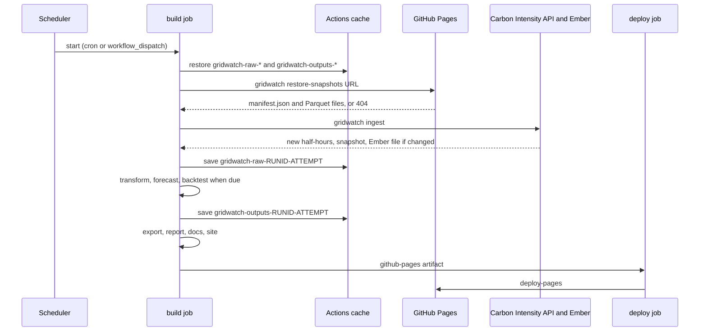
```mermaid
sequenceDiagram
    participant S as Scheduler
    participant B as build job
    participant C as Actions cache
    participant P as GitHub Pages
    participant A as Carbon Intensity API and Ember
    participant D as deploy job
    S->>B: start (cron or workflow_dispatch)
    B->>C: restore gridwatch-raw-* and gridwatch-outputs-*
    B->>P: gridwatch restore-snapshots URL
    P-->>B: manifest.json and Parquet files, or 404
    B->>A: gridwatch ingest
    A-->>B: new half-hours, snapshot, Ember file if changed
    B->>C: save gridwatch-raw-RUNID-ATTEMPT
    B->>B: transform, forecast, backtest when due
    B->>C: save gridwatch-outputs-RUNID-ATTEMPT
    B->>B: export, report, docs, site
    B->>D: github-pages artifact
    D->>P: deploy-pages
```

**Failure and error paths.**

| What goes wrong | Detected in | What the system does | State left behind | Recovery |
| --- | --- | --- | --- | --- |
| Pages not enabled (the current state) | Deploy job, `actions/deploy-pages@v5` | "Failed to create deployment (status: 404) ... Ensure GitHub Pages has been enabled"; run marked failed | Build outputs, caches and artifacts saved; no site; snapshots not published | Enable Pages ([D1](#decisions-farah-must-make)), then run the workflow by hand |
| Cache empty or evicted (unused for 7 days, or the 10 GB limit) | Restore steps ("Cache not found") | Not an error; ingest backfills the whole history | Longer run (the cold-cache build on 3 October took 24 min 28 s, 338 requests) | None; snapshots come back from the site once it is published |
| Snapshot archive unreadable (403, 5xx after retries, bad manifest, hash mismatch) | `restore_snapshots` | `SnapshotMirrorError`, exit 2; the job stops before ingest | Nothing ingested; raw cache not re-saved (the save step is skipped when ingest is skipped); site unchanged | Fix the site or `SNAPSHOT_MIRROR_URL`, rerun |
| Ingest fails part-way | `_ingest_ranges`, `ingest_snapshot`, `ingest_ember` | `IngestError`, exit 2 | Rows from earlier requests saved to the cache by *Save raw data*; later steps and the deploy skipped | Rerun; ingestion resumes from what is stored |
| New upstream gap, stale data or too many implausible values | dbt tests in `gridwatch transform` | `TransformError`, exit 2 | Raw cache saved; outputs cache and site unchanged | For a gap, [F15](#f15-gap-repair-runbook): dispatch with `repair_gaps`, then record the gap in `dbt/seeds/known_source_gaps.csv` |
| Forecast or backtest fails | M11, M12 | exit 2 | Outputs cache not saved; site unchanged | Fix, rerun; the previous outputs cache is used next time |
| Job exceeds 120 minutes | GitHub Actions | Job cancelled | Caches saved only for steps reached | Not seen: the cold-cache run used about a fifth of the limit |
| Two runs at once (schedule and manual) | `concurrency: daily-pipeline`, `cancel-in-progress: false` | The second waits; GitHub keeps at most one pending run per group | Cache keys include the run id, so runs never overwrite each other's entries | None |
| Schedule disabled after 60 days without repository activity | GitHub | No runs | Site and archive stay as last deployed; no new snapshots | *Actions > Daily pipeline > Enable workflow* |
| A step tries to write to the repository | GitHub token permissions | Refused: the build job has `contents: read` | Nothing written | Not needed by design |

### F2 Incremental ingestion of GB data

**Trigger and actors.** `gridwatch ingest` (or `run`), by the daily workflow or by hand. Actors:
the CLI, `ingest/pipeline.py`, `HttpFetcher`, the Carbon Intensity API, the raw store.

**Preconditions.** Valid settings; network access (or `--replay`); write access to
`GRIDWATCH_DATA_DIR`.

**Happy path.**

1. `cmd_ingest` takes `--as-of` or the clock as `now` (UTC), chooses the transport and builds an
   `HttpFetcher` (1 s spacing, 5 attempts, 60 s timeout by default).
2. `run_ingest` checks that `now` is time-zone-aware and that the sources are known.
3. For national, generation and regional data in turn, `_ingest_ranges` reads the stored
   `time_bounds()`.
4. `windows_to_fetch` plans: with nothing stored, `[start, floor(now))`; if the configured start
   moved earlier, a backfill window; always `[stored_max + 30 min - refetch_days, floor(now))`.
5. With `--repair-gaps`, `stored_gaps` adds a window for every hole (regional: per region, then
   merged).
6. `plan_requests` splits windows into 30-day (13-day regional) chunks that never cross a year
   and builds URLs shifted by 30 minutes.
7. For each URL: `HttpFetcher.get` (spaced, retried), `_json`, the parser for the dataset with the
   window (rows outside it dropped), then `ParquetStore.upsert` for each store (regional data
   writes two stores).
8. After all sources, `ensure_empty_datasets` writes placeholders for empty datasets; the JSON
   report goes to stdout and `ingest finished with <n> HTTP request(s)` to the log.

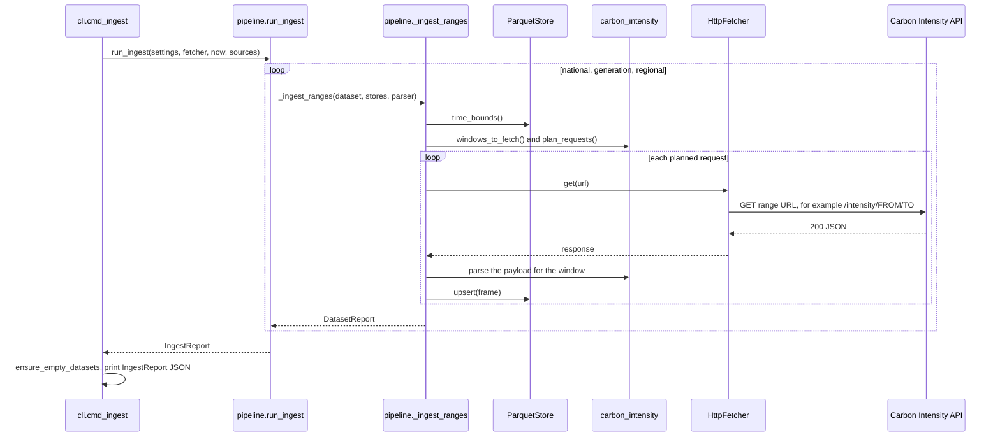
```mermaid
sequenceDiagram
    participant CLI as cli.cmd_ingest
    participant RI as pipeline.run_ingest
    participant PL as pipeline._ingest_ranges
    participant ST as ParquetStore
    participant CI as carbon_intensity
    participant HF as HttpFetcher
    participant API as Carbon Intensity API
    CLI->>RI: run_ingest(settings, fetcher, now, sources)
    loop national, generation, regional
        RI->>PL: _ingest_ranges(dataset, stores, parser)
        PL->>ST: time_bounds()
        PL->>CI: windows_to_fetch() and plan_requests()
        loop each planned request
            PL->>HF: get(url)
            HF->>API: GET range URL, for example /intensity/FROM/TO
            API-->>HF: 200 JSON
            HF-->>PL: response
            PL->>CI: parse the payload for the window
            PL->>ST: upsert(frame)
        end
        PL-->>RI: DatasetReport
    end
    RI-->>CLI: IngestReport
    CLI->>CLI: ensure_empty_datasets, print IngestReport JSON
```

**Failure and error paths.**

| What goes wrong | Detected in | What the system does | State left behind | Recovery |
| --- | --- | --- | --- | --- |
| Network error, timeout, or HTTP 408, 425, 429, 500, 502, 503 or 504 | `HttpFetcher.get` | Retries up to `GRIDWATCH_MAX_ATTEMPTS` with jittered back-off, honouring `Retry-After` up to 300 s; logs each retry | Nothing yet | Automatic |
| Still failing after the last attempt | `HttpFetcher.get` raises `FetchError`; `_ingest_ranges` wraps it | `IngestError`: `national_intensity: request 5 of 118 failed (GET ... failed: gave up after 5 attempts (...)). Rows from the 4 earlier request(s) are saved; rerun to resume.`; exit 2; later sources not run | Earlier chunks stored | Rerun |
| Other 4xx, such as 400 for a rejected range, or 401/403 if the API began to require authorisation; other 5xx statuses (for example 501) are treated the same way | `HttpFetcher.get` (not retryable) | `FetchError` at once, then `IngestError`, exit 2 | Earlier chunks stored | Check the API; if its contract changed, update M4 and re-record the cassette |
| The API answers with an error document | `_data_list` raises `ApiError` | `IngestError`, exit 2 | As above | As above |
| Body is not JSON, or has the wrong structure (a format change or a tampered response) | `_json` (`<url> did not return JSON: ...`) or the parser (`ParseError`) | `IngestError`, exit 2; nothing from that chunk is written | Earlier chunks stored | Update the parser; re-record the cassette |
| Parsed frame does not fit the stored schema | `ParquetStore._conform` raises `SchemaMismatchError` | Printed as `SchemaMismatchError: ...`, exit 2 | Earlier chunks stored | Code fix |
| Process killed during a write | `_atomic_write` | The old month file stays intact | Possibly a `.parquet.tmp` file, ignored by readers | Rerun |
| Rerun with nothing new (idempotency) | `_upsert_month` | No file rewritten | Files byte-for-byte unchanged | None |
| API revises an actual | `_upsert_month` | Row replaced, counted as `updated` | Previous value not kept (decision 3) | By design |
| A half-hour the API never serves | Not here: the dbt gap test (F5) | | | [F15](#f15-gap-repair-runbook) and the [runbook](docs/data.md#when-the-gap-test-fails) |

### F3 Forecast snapshot capture and archive

**Trigger and actors.** The daily workflow's restore, ingest and site steps. Actors:
`snapshot_mirror`, `ingest_snapshot`, the snapshot store, the API, GitHub Pages.

**Preconditions.** For capture: `now` within 30 minutes of the clock (or a replay). For
publication: Pages enabled and a successful deploy.

**Happy path.**

1. `restore_snapshots` requests `<url>manifest.json` through the rate-limited fetcher.
2. For each entry: the path must match `^\d{4}/\d{4}-\d{2}\.parquet$`; the file is downloaded,
   its SHA-256 compared with the manifest, read as Parquet and upserted into
   `data/raw/carbon_intensity/forecast_snapshots/` (key `issued_at_utc`, `period_start_utc`).
   The command prints `restored: <n> file(s), <n> new row(s), <n> unchanged`.
3. During ingest, `ingest_snapshot` sets `issued = floor_half_hour(now)`, checks the lag, requests
   `GET /intensity/<issued>/fw48h`, parses it with `parse_snapshot` and upserts it (97 rows on 3
   October 2026).
4. dbt builds `stg_carbon_intensity__forecast_snapshots` (with `lead_minutes`),
   `fct_api_forecast_snapshots` (implausible forecasts nulled and flagged, actuals joined) and
   `rpt_api_forecast_snapshot_accuracy` (accuracy by lead band once actuals exist).
5. `gridwatch site` calls `publish_snapshots`: monthly files only (never the placeholder) are
   copied to `site/data/forecast_snapshots/` with a manifest of rows and SHA-256 hashes.
6. The workflow uploads the folder as the `forecast-snapshots` artifact and deploys it with the
   site.

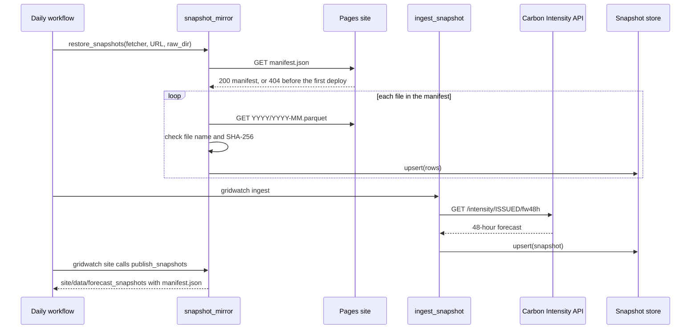
```mermaid
sequenceDiagram
    participant W as Daily workflow
    participant M as snapshot_mirror
    participant P as Pages site
    participant PL as ingest_snapshot
    participant API as Carbon Intensity API
    participant ST as Snapshot store
    W->>M: restore_snapshots(fetcher, URL, raw_dir)
    M->>P: GET manifest.json
    P-->>M: 200 manifest, or 404 before the first deploy
    loop each file in the manifest
        M->>P: GET YYYY/YYYY-MM.parquet
        M->>M: check file name and SHA-256
        M->>ST: upsert(rows)
    end
    W->>PL: gridwatch ingest
    PL->>API: GET /intensity/ISSUED/fw48h
    API-->>PL: 48-hour forecast
    PL->>ST: upsert(snapshot)
    W->>M: gridwatch site calls publish_snapshots
    M-->>W: site/data/forecast_snapshots with manifest.json
```

**Failure and error paths.**

| What goes wrong | Detected in | What the system does | State left behind | Recovery |
| --- | --- | --- | --- | --- |
| Manifest returns 404 (never deployed, which is the current state, or Pages switched off or moved) | `restore_snapshots` (`FetchError.status == 404`) | `no-mirror: 0 file(s), 0 new row(s), 0 unchanged`; the run continues | Local store holds only what the cache restored. The code cannot tell "never deployed" from "removed" | Normal before the first deploy. If the site and the cache were both lost, the `forecast-snapshots` artifact (same layout, kept 90 days) can be served over HTTP and merged with `gridwatch restore-snapshots <url>`; this is not scripted |
| Forbidden or unavailable (403, 5xx after retries, DNS) | `restore_snapshots` | `SnapshotMirrorError`, logged as `could not read the snapshot manifest: GET ... failed: ...`, exit 2; the workflow stops before it could deploy a smaller archive | Nothing changed | Restore access; rerun |
| Manifest is not JSON or lacks `files` | `restore_snapshots` | `<url>manifest.json is not a snapshot manifest`, exit 2 | Nothing merged | Republish from a good copy |
| Tampered entry: a path outside the pattern (for example `../x`) | `FILE_PATTERN` check | `unexpected file name in the manifest: '../x'`, exit 2; that file is not requested | Files listed earlier are already merged (harmless: the upsert is idempotent) | Investigate the published site |
| Tampered or corrupted file | SHA-256 comparison | `<path> does not match the SHA-256 in the manifest`, exit 2 | As above | As above |
| File is not a snapshot Parquet | `pl.read_parquet` or `upsert` | `<path> is not a snapshot file: ...`, exit 2 | As above | As above |
| `--as-of` more than 30 minutes in the past | `ingest_snapshot` lag check | Warning `forecast_snapshots: skipped, because the as-of time ... is ... behind the clock and the API does not return past forecasts as issued`; window recorded as `... skipped (as-of time in the past)` | No snapshot stored, deliberately | None: the API cannot give a past forecast as issued |
| Ingest of the other GB datasets takes over 30 minutes before the snapshot request (an edge found while preparing this plan: `now` is taken when `gridwatch ingest` starts, and the snapshot is requested after national, generation and regional data) | Same lag check | The same warning; no error | That day's snapshot is lost for good. The cold-cache ingest of 3 October 2026 reached the snapshot after 18 minutes, so it was taken | None after the fact; see [D11](#decisions-farah-must-make) |
| The API fails on `fw48h` | `ingest_snapshot` | `IngestError`, logged as `forecast_snapshots: ...`, exit 2; Ember is not ingested in that run | Range datasets already stored | Rerun soon (a later run stores a later issue time) |
| Store has only the placeholder | `publish_snapshots` | Returns 0 and writes nothing | No manifest, so the dashboard omits the archive link | None |
| Restoring the same archive twice | `upsert` | Rows counted as unchanged | No file rewritten | None |
| Implausible forecast in a snapshot | `fct_api_forecast_snapshots` | Value nulled, `is_forecast_implausible` set | Raw value kept in staging | None |

### F4 Ember yearly download

**Trigger and actors.** The `ember` source of `gridwatch ingest`. Actors: `ingest_ember`,
`ingest_ember_yearly`, `HttpFetcher`, `files.ember-energy.org`.

**Preconditions.** Network access (or a replay); for a 304, a stored file and manifest from the
same URL.

**Happy path.**

1. `ingest_ember` calls `ingest_ember_yearly(fetcher, settings.ember_yearly_url, raw_dir, now)`.
2. The manifest is loaded; if the Parquet file exists and the URL matches, `If-None-Match` and
   `If-Modified-Since` are sent.
3. 304: return `not-modified` with the stored row count and hash.
4. 200: hash the body; the same hash returns `not-modified` without rewriting; otherwise
   `parse_yearly_csv` maps and casts the 12 columns, `write_single` writes the Parquet file
   atomically and a new `manifest.json` records URL, ETag, Last-Modified, SHA-256, rows and fetch
   time; return `downloaded`.
5. The log shows `ember: <status> (<rows> rows)`.

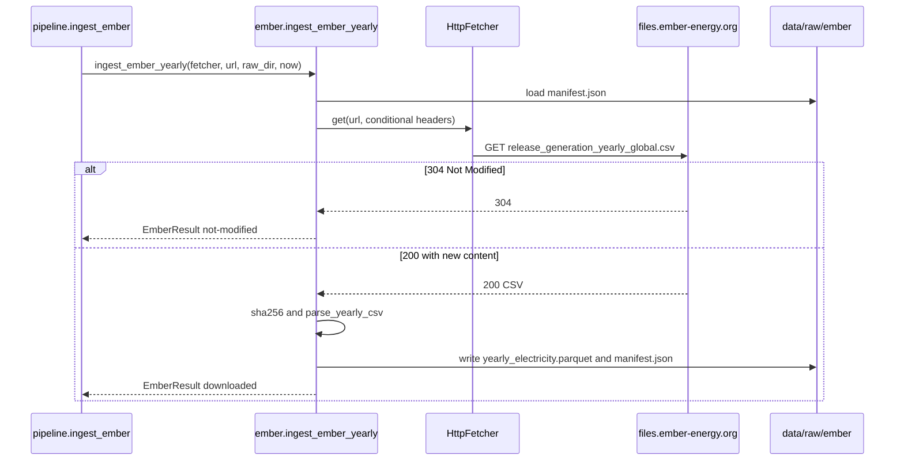
```mermaid
sequenceDiagram
    participant PL as pipeline.ingest_ember
    participant EM as ember.ingest_ember_yearly
    participant HF as HttpFetcher
    participant E as files.ember-energy.org
    participant FS as data/raw/ember
    PL->>EM: ingest_ember_yearly(fetcher, url, raw_dir, now)
    EM->>FS: load manifest.json
    EM->>HF: get(url, conditional headers)
    HF->>E: GET release_generation_yearly_global.csv
    alt 304 Not Modified
        E-->>EM: 304
        EM-->>PL: EmberResult not-modified
    else 200 with new content
        E-->>EM: 200 CSV
        EM->>EM: sha256 and parse_yearly_csv
        EM->>FS: write yearly_electricity.parquet and manifest.json
        EM-->>PL: EmberResult downloaded
    end
```

**Failure and error paths.**

| What goes wrong | Detected in | What the system does | State left behind | Recovery |
| --- | --- | --- | --- | --- |
| Download fails (network, 4xx, 5xx after retries) with a stored copy | `ingest_ember` catches `FetchError` | Warning `ember: <cause>. Keeping the file fetched at <time> (SHA-256 <12 hex>).`; status `failed-kept-previous`; GB data continues | Previous file in use | None; the next run tries again |
| Ember changes or drops a column, or a value has the wrong type | `parse_yearly_csv` (`EmberFormatError`) | Same fallback as above when a copy is stored | Previous file in use | Update `EMBER_COLUMNS` and the staging model |
| Either failure with no stored copy (first run) | `ingest_ember` | `IngestError`, logged as `ember: <cause>. No earlier Ember file is stored.`, exit 2 | GB datasets already stored | Fix the cause, rerun |
| Same content republished without an ETag | SHA-256 comparison | `not-modified`; nothing rewritten | Unchanged | None |
| New Ember release changes figures | By design | New file used from the next build | Findings section (b) may differ from the committed text | Regenerate the report, then update the findings (decision 20) |
| A compared area falls more than two years behind the newest | `assert_compared_countries_are_current` (dbt, error) | Build fails ([F5](#f5-warehouse-build-and-quality-gate)) | Raw file stored | Review `dbt/seeds/countries.csv` |

### F5 Warehouse build and quality gate

**Trigger and actors.** `gridwatch transform` (or `run`). Actors: `cmd_transform`, `run_dbt`, the
dbt child process, DuckDB.

**Preconditions.** Ember Parquet and the national folder exist; no other process holds the
warehouse file.

**Happy path.**

1. `ensure_empty_datasets` guarantees every source glob matches a file.
2. `_dbt_vars` turns `--as-of` into `as_of` (`YYYY-MM-DD HH:MM:SS`) and passes any report window.
3. `run_dbt` runs `check_inputs`, creates `data/warehouse/`, deletes the old `run_results.json`
   and starts `python -m dbt.cli.main build --project-dir ... --profiles-dir ... --target-path
   data/dbt-target --log-path data/dbt-logs [--vars ...]` with the gridwatch environment.
4. dbt loads seeds, builds staging views over the Parquet globs, then intermediate, mart and
   reporting tables, and runs data and unit tests.
5. `parse_run_results` reads every node's status; `cmd_transform` logs warnings and, on success,
   `dbt build passed: <n> nodes, <n> warning(s)`.

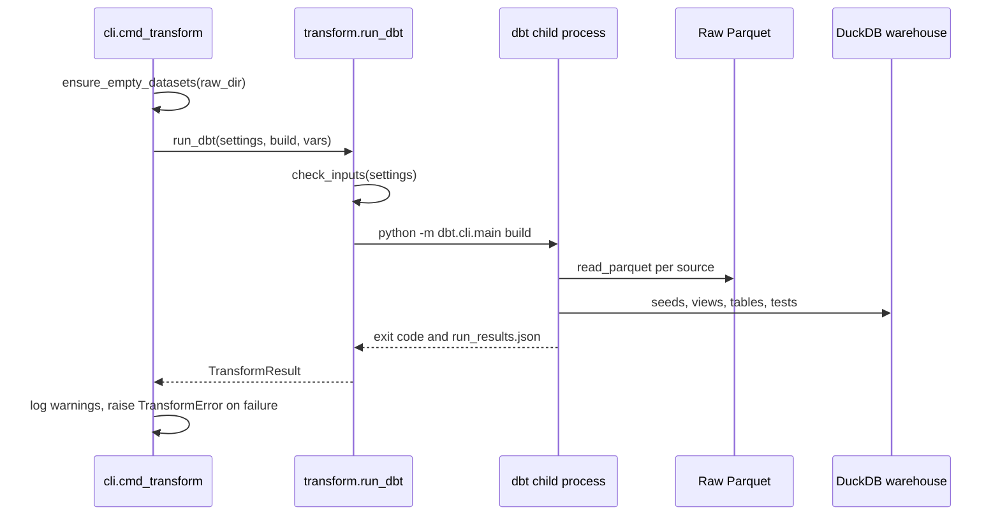
```mermaid
sequenceDiagram
    participant CLI as cli.cmd_transform
    participant TR as transform.run_dbt
    participant DBT as dbt child process
    participant RAW as Raw Parquet
    participant WH as DuckDB warehouse
    CLI->>CLI: ensure_empty_datasets(raw_dir)
    CLI->>TR: run_dbt(settings, build, vars)
    TR->>TR: check_inputs(settings)
    TR->>DBT: python -m dbt.cli.main build
    DBT->>RAW: read_parquet per source
    DBT->>WH: seeds, views, tables, tests
    DBT-->>TR: exit code and run_results.json
    TR-->>CLI: TransformResult
    CLI->>CLI: log warnings, raise TransformError on failure
```

**Failure and error paths.**

| What goes wrong | Detected in | What the system does | State left behind | Recovery |
| --- | --- | --- | --- | --- |
| No raw data | `check_inputs` | ``raw data not found: <paths>. Run `gridwatch ingest` first.``, exit 2 | Nothing built | Run `gridwatch ingest` |
| A new gap in a half-hourly series | `no_half_hour_gaps` (error) | `dbt failure: ...` per node, then `dbt build failed (<n> node(s))`, exit 2 | Warehouse partly rebuilt; in CI the runner is discarded | [Runbook](docs/data.md#when-the-gap-test-fails) |
| Newest national data older than 36 hours | `recency_within_hours` (error) | As above | As above | Check ingestion and the API; pass `--as-of` when rebuilding old data |
| More than 100 implausible values | `accepted_range` with `error_if: ">100"` | As above (1 to 100 are warnings) | As above | Investigate the source; adjust the plausible range only with a reason |
| Bank-holiday seed no longer covers the calendar | `assert_bank_holidays_cover_the_calendar` (error; a warn-level twin fires a year earlier) | As above | As above | Raise `LAST_YEAR` in `scripts/generate_bank_holidays.py`, regenerate, commit |
| A scheduling rule beats the oracle (logic error) | `assert_oracle_is_never_beaten` | As above | As above | Fix the SQL |
| Report window reversed | `UsageError` in `_dbt_vars` before dbt runs; `assert_report_window_is_valid` as a second check | exit 2 | Nothing built | Correct the dates |
| dbt crashes before writing results | `run_dbt` | `dbt build exited with code <n>`, exit 2 | Unknown partial state | Read `data/dbt-logs/` |
| Warehouse locked by another process (concurrency) | DuckDB in the dbt child | Node errors, then `TransformError`, exit 2 | Unchanged | Stop the other process, rerun |
| Out of memory | DuckDB (`memory_limit`) | Node errors, exit 2 | Partly rebuilt | Raise `GRIDWATCH_DUCKDB_MEMORY` |
| Invalid `GRIDWATCH_DUCKDB_MEMORY` | `Settings.from_env` | `ConfigError`, exit 2 before dbt starts | Nothing built | Correct the value |

### F6 48-hour forecast

**Trigger and actors.** `gridwatch forecast` (or `run`). Actors: `cmd_forecast`, `run_forecast`,
`load_national_series`, `IntensityForecaster`.

**Preconditions.** A built warehouse whose national history is longer than two weeks plus 48
hours (training uses up to `--train-days` of it) and gives at least 1,000 usable training rows.

**Happy path.**

1. `_model_config` builds `ModelConfig(train_days, calibration_days = min(value, train_days //
   5))`.
2. `load_national_series` opens the warehouse read-only, selects `period_start_utc`,
   `actual_gco2_kwh`, `forecast_gco2_kwh` from `marts.fct_national_intensity` and checks the grid.
3. `forecast_next` takes the last non-missing actual as the origin, builds the calendar to 96
   half-hours past it and the trailing statistics.
4. `fit`: training origins every 6 hours, from two weeks into the series or `train_days` before
   the origin (whichever is later) up to 48 hours before the origin, skipping origins with no
   value; rows with a missing target or last value are dropped; 27 features per origin and horizon; target = value minus last value; rows weighted by inverse
   horizon variance; point model on all rows, quantile models without the last
   `calibration_days`; conformal widening per 6-hour band from the held-out rows.
5. `predict`: features at the origin, point = model + last value, interval = quantiles +
   last value, widened, and never crossing the point.
6. `run_forecast` writes `data/outputs/forecast_latest.parquet` (96 rows, issued at the
   half-hour after the origin); the CLI prints the first four rows in plain ASCII and
   `... 96 half-hours in <path>`.

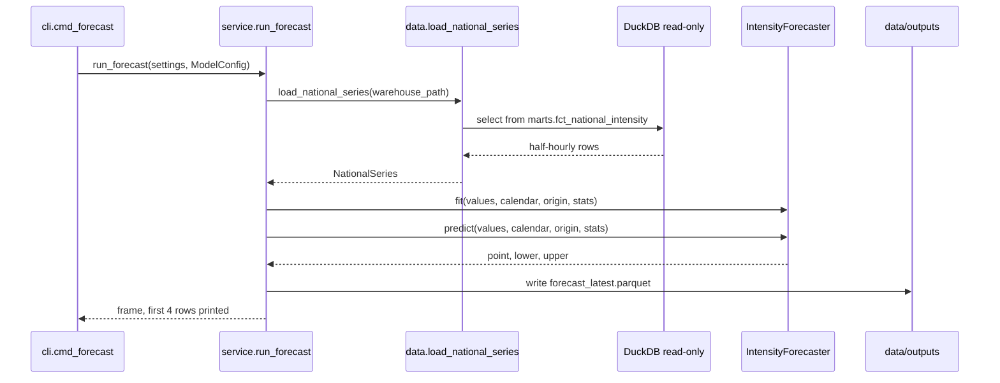
```mermaid
sequenceDiagram
    participant CLI as cli.cmd_forecast
    participant SV as service.run_forecast
    participant DA as data.load_national_series
    participant WH as DuckDB read-only
    participant MO as IntensityForecaster
    participant OUT as data/outputs
    CLI->>SV: run_forecast(settings, ModelConfig)
    SV->>DA: load_national_series(warehouse_path)
    DA->>WH: select from marts.fct_national_intensity
    WH-->>DA: half-hourly rows
    DA-->>SV: NationalSeries
    SV->>MO: fit(values, calendar, origin, stats)
    SV->>MO: predict(values, calendar, origin, stats)
    MO-->>SV: point, lower, upper
    SV->>OUT: write forecast_latest.parquet
    SV-->>CLI: frame, first 4 rows printed
```

**Failure and error paths.**

| What goes wrong | Detected in | What the system does | State left behind | Recovery |
| --- | --- | --- | --- | --- |
| No warehouse | `load_national_series` | `SeriesError`, logged as ``<path> does not exist; run `gridwatch transform` first``, exit 2 | Nothing written | Run `gridwatch transform` |
| Empty mart, gaps or duplicates, no actuals | `NationalSeries.from_frame`, `last_actual_index` | `the national series is empty`, `... has gaps or duplicates; rebuild the marts`, `the series has no actual values`; exit 2 | Previous forecast file kept | Rebuild the warehouse; check ingestion |
| Too little history | `training_origins`, `fit` | `NotEnoughHistoryError`, logged as `need more than <n> periods before the cutoff` or `only <n> usable training rows`, exit 2 | As above | Ingest more history or lower `--train-days` (minimum 14) |
| Too little data to hold out for calibration | `fit` | Quantile models fitted on all rows, no widening; no error | Forecast written with an uncalibrated interval | Use a longer history |
| Invalid options | argparse | `5 is not between 14 and 3650`, exit 2 | Nothing run | Correct the option |
| Warehouse locked by a running dbt build | DuckDB | `IOException: ...`, exit 2 | Unchanged | Wait for the build |

### F7 Backtest and validation runs

**Trigger and actors.** `gridwatch backtest` by the daily workflow (weekly) or by hand for
validation runs (`--until`) and the pinned test year (`--last-origin`).

**Preconditions.** A built warehouse with enough history for the first block's model (as in
[F6](#f6-48-hour-forecast)) and room for `test_days` daily origins.

**Happy path.**

1. `cmd_backtest` builds `BacktestConfig` (365 test days, retrain every 28, origin hour 0, model
   settings, optional `last_origin_utc`) and the optional `until`.
2. `run_backtest_job` loads the series and, with `--until`, truncates it before that time.
3. `origin_indices` lists daily issue times whose 48 hours of targets fall at or before the last
   actual (missing targets are dropped later by `complete_pairs`), keeps those up to the pinned
   issue time if one is given, and takes the last `test_days`.
4. For each block of `retrain_every_days` origins, the model is fitted on data before the
   block's first origin; each origin gets the model forecast and interval, persistence, the two
   seasonal naive baselines and the API's retained forecast.
5. `summarise`, `interval_coverage`, `lead_time_breakdown`, `monthly_breakdown` and `win_rates`
   score every method on the common sample.
6. Predictions and the summary JSON are written (suffixed for validation runs); the log shows MAE,
   RMSE and MAPE per band and method.

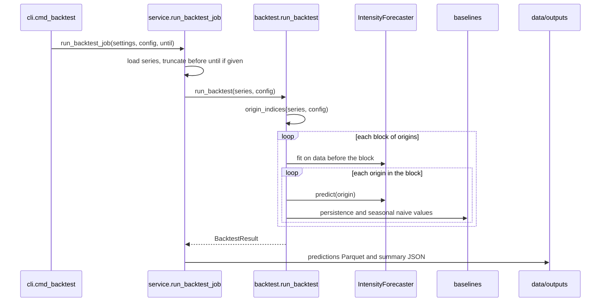
```mermaid
sequenceDiagram
    participant CLI as cli.cmd_backtest
    participant SV as service.run_backtest_job
    participant BT as backtest.run_backtest
    participant MO as IntensityForecaster
    participant BL as baselines
    participant OUT as data/outputs
    CLI->>SV: run_backtest_job(settings, config, until)
    SV->>SV: load series, truncate before until if given
    SV->>BT: run_backtest(series, config)
    BT->>BT: origin_indices(series, config)
    loop each block of origins
        BT->>MO: fit on data before the block
        loop each origin in the block
            BT->>MO: predict(origin)
            BT->>BL: persistence and seasonal naive values
        end
    end
    BT-->>SV: BacktestResult
    SV->>OUT: predictions Parquet and summary JSON
```

**Failure and error paths.**

| What goes wrong | Detected in | What the system does | State left behind | Recovery |
| --- | --- | --- | --- | --- |
| Pinned last origin not available | `origin_indices` | `ValueError: no complete 48-hour test for a forecast issued at <time> UTC; the latest issue time the data allows is <time>`, exit 2 | Previous outputs kept | Pick an earlier `--last-origin` or ingest more data |
| No origin at all | `run_backtest` | `ValueError: not enough data for a single backtest origin`, exit 2 | As above | More data, fewer `--test-days` |
| `--until` before the data starts | `NationalSeries.truncate` | `SeriesError`, logged as `no data before <time>`, exit 2 | As above | Correct `--until` |
| Too little history for a block | `fit` | `NotEnoughHistoryError`, exit 2 | As above | Lower `--train-days` |
| Missing actual at an origin | `complete_pairs` | That origin drops out for every method | Fewer scored pairs | None: the comparison stays fair |
| Rerun with the same settings (idempotency) | File names | Main or suffixed files overwritten with the new result; other validation runs untouched | | None |
| Cached backtest in the daily workflow | `pipeline.yml` | Not rerun; the workflow log prints the cached summary's `generated_at_utc`. The backtest chart shows the period tested, not when it was run (record 15 says the page states the generation time; see [roadmap item 6](#7-execution-roadmap)) | Up to a week old | Dispatch with `backtest` ticked |

### F8 Report and the docs-number check

**Trigger and actors.** Farah runs `gridwatch report` before editing the findings; the daily
workflow writes an artifact copy; CI runs `tests/test_docs_numbers.py`.

**Preconditions.** A built warehouse; backtest outputs for the forecast sections; enough complete
days in the report window (at least seven days on which every scheduling rule is scored, the
bootstrap's block length).

**Happy path.**

1. `cmd_report` checks the warehouse and calls `write_report`.
2. `build_report` opens the warehouse read-only and reads the window, coverage, batch-job tables,
   country tables, seasonal and regional tables, and API accuracy tables.
3. It computes saving intervals (`saving_interval`, 7-day blocks, 2,000 resamples, seed
   20260925) and Diebold-Mariano tests (`diebold_mariano`, 7 lags) from the stored predictions.
4. It adds the backtest, lead-time and validation sections from `data/outputs/` and the Ember
   version from the raw manifest, and writes `docs/generated/report.md`.
5. In CI, `test_every_quoted_number_is_in_the_generated_report` checks the prose against it.

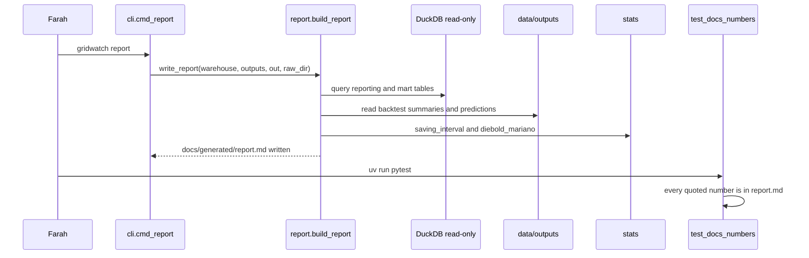
```mermaid
sequenceDiagram
    participant U as Farah
    participant CLI as cli.cmd_report
    participant RP as report.build_report
    participant WH as DuckDB read-only
    participant OUT as data/outputs
    participant ST as stats
    participant T as test_docs_numbers
    U->>CLI: gridwatch report
    CLI->>RP: write_report(warehouse, outputs, out, raw_dir)
    RP->>WH: query reporting and mart tables
    RP->>OUT: read backtest summaries and predictions
    RP->>ST: saving_interval and diebold_mariano
    RP-->>CLI: docs/generated/report.md written
    U->>T: uv run pytest
    T->>T: every quoted number is in report.md
```

**Failure and error paths.**

| What goes wrong | Detected in | What the system does | State left behind | Recovery |
| --- | --- | --- | --- | --- |
| No warehouse | `_require_warehouse` | ``no warehouse at <path>; run `gridwatch transform` first``, exit 2 | Old report kept | Build the warehouse |
| No day in the window has every rule scored | `build_report`: the `profile_overall` query's `.row(0, named=True)` on an empty frame | `polars.exceptions.OutOfBoundsError: index 0 is out of bounds for sequence of length 0`, not caught by `cli.main`: traceback, exit 1. The intended message (`the report window has too few complete days for the batch-job analysis; widen it with --report-start and --report-end`) is never reached | Old report kept | Widen the window with `--report-start`/`--report-end`; see [D11](#decisions-farah-must-make) |
| 1 to 6 days with every rule scored | `saving_interval` (`moving_block_indices`, 7-day blocks) | `ValueError: block_length must be between 1 and n`, exit 2 | Old report kept | Widen the window |
| No backtest yet | `_backtest_section` | Section says ``_Not run yet: `gridwatch backtest`._`` | Report written | Run the backtest |
| Statistics undefined (identical losses) or too few forecast days | `diebold_mariano` raises `ValueError`, caught in `_diebold_mariano_table` | That comparison is left out of the Diebold-Mariano table; if no comparison can be computed, the table is omitted; exit 0 | Report written without those rows | Check the predictions if rows are missing on a full test year |
| Prose quotes a stale or mistyped number | `tests/test_docs_numbers.py` | Test fails, listing the missing token; CI fails | The CI check fails on the commit or pull request; the daily pipeline and the dashboard are not affected | Regenerate the report, then fix the prose (decision 20) |
| Warehouse locked | DuckDB | `IOException: ...`, exit 2 (tested) | Old report kept | Wait and rerun |

### F9 Dashboard build and viewing

**Trigger and actors.** `gridwatch site` (or `run`); later, any visitor's browser. Actors:
`build_site`, `publish_snapshots`, `collect`, `all_charts`, `render`, `app.js`, Plotly.

**Preconditions.** A built warehouse; optionally forecast and backtest outputs, the annual CSV,
the Power BI files and the dbt docs already in the output folder.

**Happy path.**

1. `cmd_site` checks the warehouse and calls `build_site(..., raw_dir)`.
2. `publish_snapshots` writes `site/data/forecast_snapshots/` ([F3](#f3-forecast-snapshot-capture-and-archive)).
3. `collect` reads the data-through time, report window, key figures, the last two days,
   the latest API snapshot (`lead_minutes >= 0`), profiles, strategies, monthly, regional and
   country tables, then the forecast and backtest files.
4. `render` builds the nine charts and tiles, renders `index.html.j2` with autoescaping, embeds
   the chart JSON safely, writes `assets/plotly.min.js`, `style.css`, `app.js`, copies the
   annual CSV to `data/`, and writes `.nojekyll`.
5. In the browser, `app.js` parses `#chart-data`, builds each table view, then draws each chart
   with `Plotly.react` using colours from CSS custom properties; it redraws when the colour scheme
   or `data-theme` changes.

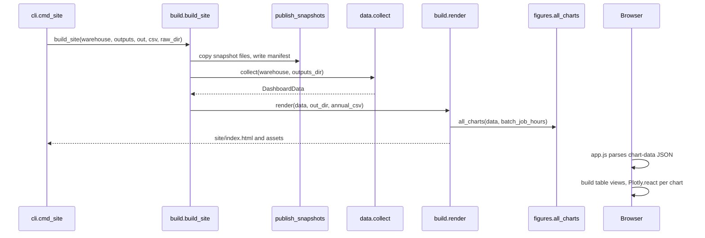
```mermaid
sequenceDiagram
    participant CLI as cli.cmd_site
    participant B as build.build_site
    participant M as publish_snapshots
    participant D as data.collect
    participant R as build.render
    participant F as figures.all_charts
    participant BR as Browser
    CLI->>B: build_site(warehouse, outputs, out, csv, raw_dir)
    B->>M: copy snapshot files, write manifest
    B->>D: collect(warehouse, outputs_dir)
    D-->>B: DashboardData
    B->>R: render(data, out_dir, annual_csv)
    R->>F: all_charts(data, batch_job_hours)
    R-->>CLI: site/index.html and assets
    BR->>BR: app.js parses chart-data JSON
    BR->>BR: build table views, Plotly.react per chart
```

**Failure and error paths.**

| What goes wrong | Detected in | What the system does | State left behind | Recovery |
| --- | --- | --- | --- | --- |
| No warehouse | `_require_warehouse` | ``no warehouse at <path>; run `gridwatch transform` first``, exit 2 | Site folder unchanged | Build the warehouse |
| No forecast or backtest yet | `collect`, `figures.backtest` | Chart shows "Backtest not run yet."; the forecast lines are absent; the model tile is omitted | Page built | Run them |
| Chart without rows (for example regional data starting after the window) | `figures.*` via `_empty` | "No data yet for this chart." and the reason in the subtitle; no table | Page built | None |
| Text in the data that looks like HTML or `</script>` (tampered input) | Jinja2 autoescape, `_json_for_script`, `textContent` in `app.js` | Rendered as text | Page safe | None |
| JavaScript disabled or Plotly fails to load | `app.js` (`typeof Plotly === "undefined"`) | Charts not drawn; with JavaScript off the table views are not built either; header, tiles and text still show | | None |
| Empty `rpt_batch_job_start_slots` | `collect` (key-figure query indexed with `[0]`) | `IndexError`, not caught by `cli.main`: traceback, exit 1 | `index.html` and assets not written (any earlier `index.html` remains); `site/data/forecast_snapshots/` already rewritten by `publish_snapshots` (when the store has snapshot files) | Widen the window; see [D11](#decisions-farah-must-make) |
| Site served from disk | Browser | Works: every asset path is relative and Plotly is local | | None |

### F10 Exports

**Trigger and actors.** `gridwatch export` (or `run`); the daily workflow. Actors: `cmd_export`,
`export_annual_intensity`, `export_powerbi`.

**Preconditions.** A built warehouse.

**Happy path.**

1. `cmd_export` checks the warehouse.
2. `export_annual_intensity` writes `reporting.rpt_annual_grid_intensity_export` ordered by peer
   group, country and year to the CSV and logs the row count.
3. With `--powerbi-dir`, `export_powerbi` runs the ten queries in `POWERBI_TABLES` (the
   half-hourly fact limited to the last `--half-hourly-days`), writes one CSV each and a
   `manifest.json` with row counts and sources.

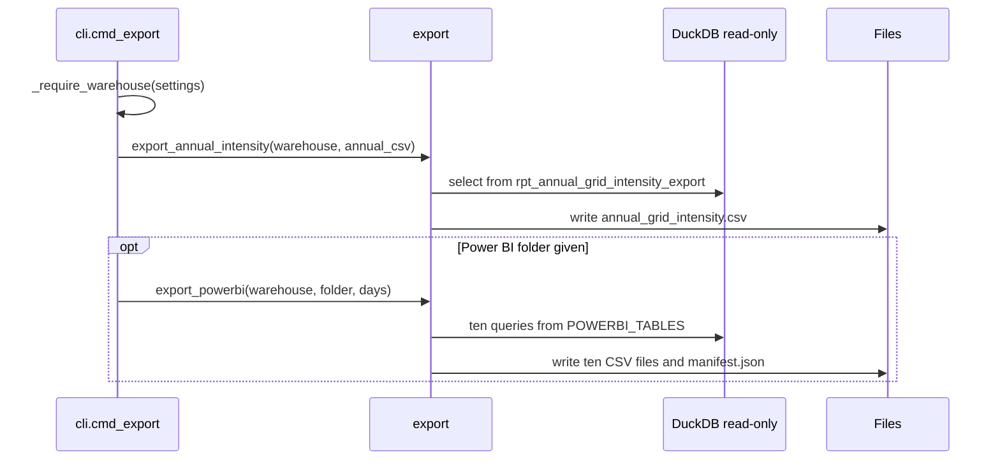
```mermaid
sequenceDiagram
    participant CLI as cli.cmd_export
    participant EX as export
    participant WH as DuckDB read-only
    participant FS as Files
    CLI->>CLI: _require_warehouse(settings)
    CLI->>EX: export_annual_intensity(warehouse, annual_csv)
    EX->>WH: select from rpt_annual_grid_intensity_export
    EX->>FS: write annual_grid_intensity.csv
    opt Power BI folder given
        CLI->>EX: export_powerbi(warehouse, folder, days)
        EX->>WH: ten queries from POWERBI_TABLES
        EX->>FS: write ten CSV files and manifest.json
    end
```

**Failure and error paths.**

| What goes wrong | Detected in | What the system does | State left behind | Recovery |
| --- | --- | --- | --- | --- |
| No warehouse | `_require_warehouse` | Message as in F9, exit 2 | Old files kept | Build the warehouse |
| `--half-hourly-days` not a whole number or out of range | argparse | `'lots' is not a whole number`, exit 2 | Nothing written | Correct it |
| Output folder not writable | `OSError` | `<Type>: <message>`, exit 2 | Files written so far remain | Fix the path |
| A model column was renamed | DuckDB binder error | `<Type>: <message>`, exit 2 | Partial set of CSVs | Update `export.py` and `powerbi/README.md` together |

### F11 Offline replay run

**Trigger and actors.** The README quick start, the CI `pipeline-on-fixtures` job and
`tests/test_end_to_end.py`. Actors: a developer or CI, `ReplayTransport`, the cassette.

**Preconditions.** A POSIX shell (bash or Git Bash) for `set -a; . tests/fixtures/fixture.env`;
the fixture settings exported exactly.

**Happy path.**

1. Export the settings in `tests/fixtures/fixture.env` and `GRIDWATCH_DATA_DIR=data/demo`.
2. `gridwatch run --replay tests/fixtures/cassette --as-of "$FIXTURE_AS_OF" --skip-backtest
   --train-days 30` (the README quick start).
3. Every HTTP request is answered by `ReplayTransport` from `index.json`; there is no request
   spacing; the snapshot is stored even though the as-of time is in the past.
4. Transform (with `as_of` pinning the freshness test), forecast, export, docs and site run on
   local files; `site/index.html` opens from disk.

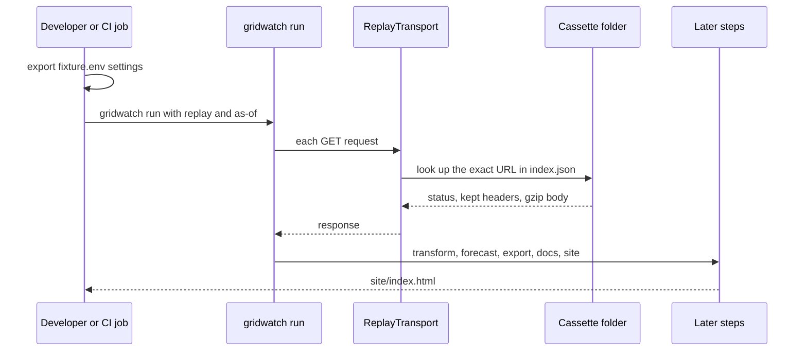
```mermaid
sequenceDiagram
    participant U as Developer or CI job
    participant CLI as gridwatch run
    participant RT as ReplayTransport
    participant CAS as Cassette folder
    participant PIPE as Later steps
    U->>U: export fixture.env settings
    U->>CLI: gridwatch run with replay and as-of
    CLI->>RT: each GET request
    RT->>CAS: look up the exact URL in index.json
    CAS-->>RT: status, kept headers, gzip body
    RT-->>CLI: response
    CLI->>PIPE: transform, forecast, export, docs, site
    PIPE-->>U: site/index.html
```

**Failure and error paths.**

| What goes wrong | Detected in | What the system does | State left behind | Recovery |
| --- | --- | --- | --- | --- |
| Settings differ from `fixture.env`, so a URL was never recorded | `ReplayTransport.handle_request` | `CassetteMissError`, logged as `no recording for <url>; re-record with scripts/record_fixtures.py`, exit 2 | Earlier requests stored | Export the fixture settings exactly, or re-record ([F14](#f14-re-recording-the-test-cassette)) |
| Cassette folder empty or wrong | `ReplayTransport.__init__` | `no recordings found in <dir>`, exit 2 | Nothing | Point `--replay` at `tests/fixtures/cassette` |
| `--as-of` omitted on transform | `recency_within_hours` | Build fails, since the fixture data ends on 2026-09-20 | | Pass `--as-of "$FIXTURE_AS_OF"` |
| Two months of data | By design | Several charts sparse, regional chart empty | | None |

### F12 Continuous integration

**Trigger and actors.** A push to `main` or any pull request, including Dependabot's. Actors:
GitHub Actions, the three CI jobs.

**Preconditions.** None beyond the repository; no secrets are used.

**Happy path.**

1. `lint`: `uv sync --locked`, `ruff format --check .`, `ruff check .`, `mypy`, actionlint in
   Docker, `scripts/check_action_refs.py`.
2. `test` on Python 3.12 and 3.13: `pytest --cov` with the network blocked; coverage XML uploaded.
3. `pipeline-on-fixtures`: ingest from the cassette, transform, forecast (`--train-days 30`),
   a short backtest (`--test-days 7 --retrain-every 7`), report, export, docs and site; the
   result is uploaded as `dashboard-from-fixtures`.
4. GitHub records each job's status on the commit or pull request.

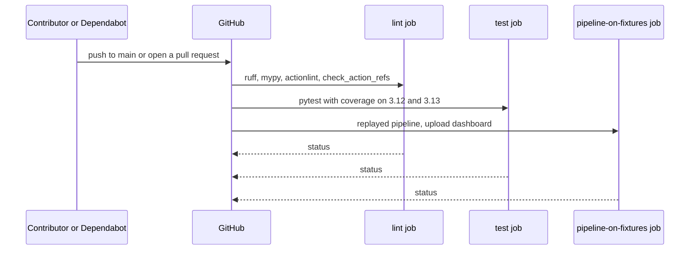
```mermaid
sequenceDiagram
    participant DEV as Contributor or Dependabot
    participant GH as GitHub
    participant L as lint job
    participant T as test job
    participant P as pipeline-on-fixtures job
    DEV->>GH: push to main or open a pull request
    GH->>L: ruff, mypy, actionlint, check_action_refs
    GH->>T: pytest with coverage on 3.12 and 3.13
    GH->>P: replayed pipeline, upload dashboard
    L-->>GH: status
    T-->>GH: status
    P-->>GH: status
```

**Failure and error paths.**

| What goes wrong | Detected in | What the system does | State left behind | Recovery |
| --- | --- | --- | --- | --- |
| Formatting, lint or type error | ruff, mypy | Job fails | The check shows as failed on the commit or pull request | Fix the code |
| Action tag missing, or SHA and version comment disagree | `check_action_refs.py` | Lists each problem, exits 1 | Job fails | Correct the reference (Dependabot updates SHA and comment together) |
| A test opens a socket | pytest-socket | Test errors | Job fails | Use the cassette or a fake |
| Stale number in the findings | `tests/test_docs_numbers.py` | Test fails | Job fails | Regenerate the report and fix the prose |
| Pull request from a fork | `permissions: contents: read`, no secrets | Runs normally with a read-only token | | None |
| Superseded push to the same branch | `concurrency` with `cancel-in-progress: true` | Older run cancelled | | None |

### F13 dbt docs build and publication

**Trigger and actors.** `gridwatch docs` by hand, `gridwatch run` (which runs it before `site`),
the daily workflow's *Exports, report, dbt docs and dashboard* step (`--out site/dbt`), the CI
fixture job and `tests/test_end_to_end.py`. Actors: `cmd_docs`, `transform.generate_docs`,
`run_dbt`, the dbt child process, DuckDB, `dashboard.build.render`.

**Preconditions.** A built warehouse (`gridwatch transform`); the raw Ember file and the
national-intensity folder, because `run_dbt` runs `check_inputs`; no other process holding the
warehouse file.

**Happy path.**

1. `cmd_docs` calls `generate_docs(settings, Path(args.out))` (default `site/dbt`; `run` passes
   `<site-dir>/dbt`).
2. `generate_docs` checks that `settings.warehouse_path` exists.
3. `run_dbt(settings, ("docs", "generate", "--static"))` runs `check_inputs`, deletes any old
   `data/dbt-target/run_results.json` and starts `python -m dbt.cli.main docs generate --static`
   with the project, profiles, target and log paths and the gridwatch environment (no `--vars`).
4. dbt compiles the project (models, tests, exposures), reads table and column metadata from the
   warehouse and writes `data/dbt-target/static_index.html`, a single page with the docs data
   built in.
5. If the child exited with status 0 and the page exists, `generate_docs` creates the output
   folder and copies the page to `<out>/index.html`; the CLI logs `dbt docs written to <path>`.
6. `gridwatch site`, run next into the same site folder, sets `has_dbt_docs` because
   `site/dbt/index.html` exists, and the footer links *dbt docs* (`dbt/index.html`).
7. The daily workflow deploys `site/`, so the docs are published under `dbt/` on the Pages site
   (FR-15; pending [D1](#decisions-farah-must-make)).

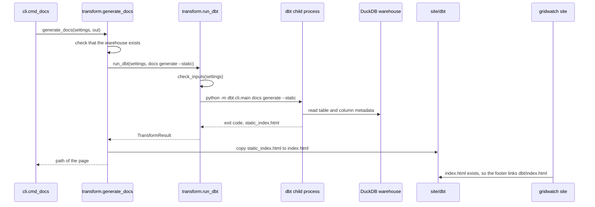
```mermaid
sequenceDiagram
    participant CLI as cli.cmd_docs
    participant GD as transform.generate_docs
    participant RD as transform.run_dbt
    participant DBT as dbt child process
    participant WH as DuckDB warehouse
    participant OUT as site/dbt
    participant S as gridwatch site
    CLI->>GD: generate_docs(settings, out)
    GD->>GD: check that the warehouse exists
    GD->>RD: run_dbt(settings, docs generate --static)
    RD->>RD: check_inputs(settings)
    RD->>DBT: python -m dbt.cli.main docs generate --static
    DBT->>WH: read table and column metadata
    DBT-->>RD: exit code, static_index.html
    RD-->>GD: TransformResult
    GD->>OUT: copy static_index.html to index.html
    GD-->>CLI: path of the page
    S->>OUT: index.html exists, so the footer links dbt/index.html
```

**Failure and error paths.**

| What goes wrong | Detected in | What the system does | State left behind | Recovery |
| --- | --- | --- | --- | --- |
| No warehouse | `generate_docs` | `TransformError`, logged as ``no warehouse at <path>; run `gridwatch transform` first``, exit 2 | Nothing written | Run `gridwatch transform` |
| Raw inputs missing (for example a different `GRIDWATCH_DATA_DIR`) | `check_inputs`, reached through `run_dbt` | `TransformError`, logged as ``raw data not found: <paths>. Run `gridwatch ingest` first.``, exit 2 | Nothing written | Point `GRIDWATCH_DATA_DIR` at the data, or run `gridwatch ingest` |
| dbt fails before writing any results | `run_dbt` | `dbt docs generate --static exited with code <n>`, exit 2 | Any earlier `<out>/index.html` unchanged | Read `data/dbt-logs/` |
| dbt reports an error, or writes no `static_index.html` | `generate_docs` | `dbt docs generate failed; see the dbt log above`, exit 2 | As above | Fix the cause shown in the dbt log, rerun |
| Warehouse open in another process (concurrency) | DuckDB in the dbt child | dbt cannot open the file; one of the two messages above, exit 2 | As above | Stop the other process, rerun |
| Docs built after the dashboard | `render` (`has_dbt_docs`) | The page is built without the footer link | Docs present but not linked | Rerun `gridwatch site`; `run` and both workflows run `docs` before `site` |
| Failure inside the daily workflow | The *Exports, report, dbt docs and dashboard* step | The step stops; `site` is not built and the deploy is skipped | Live site unchanged | Fix the cause, run the workflow again |
| Published description out of date | Content of `dbt/models/exposures.yml` | The `gridwatch_dashboard` exposure says the address goes live once Pages is enabled | | [Roadmap item 2](#7-execution-roadmap) |

Covered by `tests/test_end_to_end.py::test_site` (the page contains
`exposure.gridwatch.gridwatch_dashboard` and the dashboard links `dbt/index.html`). The
missing-warehouse case for `docs` is not in `test_commands_that_read_the_warehouse_explain_what_to_do`,
which covers `report`, `export` and `site`.

### F14 Re-recording the test cassette

**Trigger and actors.** Farah, when the API or Ember changes format
([decision 14](docs/decisions.md#14-tests-and-ci-never-call-the-network)), when
`tests/fixtures/fixture.env` changes, or when a code change alters the URLs requested (a replay
then raises `CassetteMissError`). Actors: `scripts/record_fixtures.py`, `run_ingest`,
`HttpFetcher` over `RecordingTransport`, the Carbon Intensity API, Ember,
`tests/fixtures/cassette/`.

**Preconditions.** Network access (the script runs outside pytest, so pytest-socket does not
apply); `uv sync`; the intended settings in `tests/fixtures/fixture.env`; the committed cassette
unchanged in git, so it can be restored.

**Happy path.**

1. `uv run python scripts/record_fixtures.py`.
2. `main` reads `fixture.env`, deletes `tests/fixtures/cassette/` and recreates it empty.
3. `record_carbon_intensity` builds `Settings` from the fixture values with a temporary data
   directory and an `HttpFetcher` over `RecordingTransport(CASSETTE)` (1-second spacing, 60 s
   timeout, the default `RetryPolicy` of 5 attempts). It runs `run_ingest` for national,
   generation, regional and snapshot at `FIXTURE_AS_OF` with `allow_past_snapshot=True` and
   prints the ingest report.
4. For every response, `RecordingTransport.handle_request` writes the gzip body under
   `body_name(url)` (first 16 hex characters of the URL's SHA-256) and rewrites `index.json`
   with the status and the `KEPT_HEADERS`. A retried URL keeps its last response.
5. `record_trimmed_ember` downloads the full Ember CSV with a plain `httpx.Client` (300-second
   timeout, `raise_for_status`, no retries), keeps the rows whose `Area` is an `ember_area` in
   `dbt/seeds/countries.csv` (all columns and years), stores the body and adds the URL to
   `index.json` with the full file's ETag and Last-Modified. It prints
   `Ember: kept <n> rows for <n> areas`.
6. Farah runs `uv run pytest`. Some assertions pin values in the recorded window
   ([tests/fixtures/README.md](tests/fixtures/README.md)); they are updated where the new
   recording legitimately differs, and the README's recording date and list of upstream errors
   in the window are brought up to date.
7. The new cassette is committed; CI's `pipeline-on-fixtures` job and `tests/test_end_to_end.py`
   replay it ([F11](#f11-offline-replay-run)).

`gridwatch ingest --record DIR` records any ingest run into `DIR` through the same transport
(request spacing on, Ember untrimmed, about 16 MB); the committed cassette is made by the script.

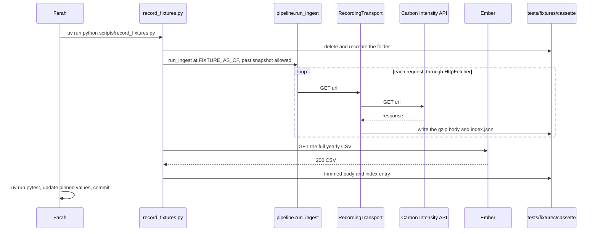
```mermaid
sequenceDiagram
    participant U as Farah
    participant RF as record_fixtures.py
    participant RI as pipeline.run_ingest
    participant RT as RecordingTransport
    participant API as Carbon Intensity API
    participant E as Ember
    participant CAS as tests/fixtures/cassette
    U->>RF: uv run python scripts/record_fixtures.py
    RF->>CAS: delete and recreate the folder
    RF->>RI: run_ingest at FIXTURE_AS_OF, past snapshot allowed
    loop each request, through HttpFetcher
        RI->>RT: GET url
        RT->>API: GET url
        API-->>RT: response
        RT->>CAS: write the gzip body and index.json
    end
    RF->>E: GET the full yearly CSV
    E-->>RF: 200 CSV
    RF->>CAS: trimmed body and index entry
    U->>U: uv run pytest, update pinned values, commit
```

**Failure and error paths.**

| What goes wrong | Detected in | What the system does | State left behind | Recovery |
| --- | --- | --- | --- | --- |
| No network, or the API still fails after the retries | `HttpFetcher.get`, then `_ingest_ranges` or `ingest_snapshot` | `IngestError`; the script has no handler, so a traceback and exit status 1 | The old cassette is already deleted; the folder holds only the responses recorded so far | `git restore tests/fixtures/cassette`, delete any new untracked bodies in it, rerun later |
| Ember download fails (HTTP error or timeout) | `response.raise_for_status()` or httpx | `httpx.HTTPStatusError` or a transport error: traceback, exit 1 | API responses recorded but no Ember entry, so a replay raises `CassetteMissError` for the Ember URL | Rerun the script (it starts again from an empty folder) or restore from git |
| Ember renames the `Area` column | `header.index("Area")` | `ValueError`: traceback, exit 1 | As above | Update the script, `EMBER_COLUMNS` and the staging model ([F4](#f4-ember-yearly-download)) |
| Ember renames a compared area | Trimming by `ember_area` | Fewer rows kept; the printed count drops | Cassette without that area | Check the printed count; update `dbt/seeds/countries.csv` |
| API values in the window were revised since the last recording | Tests that pin recorded values | Assertions fail | New cassette not yet committed | Confirm the change is upstream, then update the assertions |
| `fixture.env` changed but the cassette not re-recorded | `ReplayTransport.handle_request` | `CassetteMissError` in the tests and CI ([F11](#f11-offline-replay-run)) | | Re-record |
| Cassette made with `gridwatch ingest --record` and a past `--as-of` | `ingest_snapshot` lag check while recording | The snapshot is skipped, so its URL is not recorded; a later `--replay`, which allows past snapshots, raises `CassetteMissError` for the `fw48h` URL | | Record with the script, which sets `allow_past_snapshot=True`, or replay with `--source` values that leave out `snapshot` |
| The recorded snapshot is for a past time | By design | It holds the API's retained short-lead values, not a forecast as issued (fixtures README) | Test data only, never a day-ahead record | None |
| Credentials in the committed cassette | `KEPT_HEADERS` | Only `content-type`, `etag`, `last-modified` and `retry-after` response headers are stored; no request headers are recorded, and no credential exists | | None |

### F15 Gap repair runbook

The operator procedure in [docs/data.md](docs/data.md#when-the-gap-test-fails), shown end to end.

**Trigger and actors.** The daily build fails at *dbt build* with a `no_half_hour_gaps` failure
([F5](#f5-warehouse-build-and-quality-gate)), or Farah suspects a hole in the cached raw
history. Actors: Farah, the *Daily pipeline* workflow with the `repair_gaps` input,
`_ingest_ranges` and `stored_gaps`, the Carbon Intensity API, the Actions cache,
`dbt/seeds/known_source_gaps.csv`, the gap test.

**Preconditions.** Write access to the repository (to dispatch the workflow and commit the seed);
the raw history in the Actions cache (otherwise the next run backfills it).

**Happy path.**

1. The scheduled run fails at *dbt build*: `dbt failure: <test node> (<message>)` for each failing
   test, then `dbt build failed (<n> node(s))`, exit 2. *Save raw data* has already stored the raw
   data; the deploy is skipped and the site keeps the last good build.
2. Farah identifies the gap: the test returns `gap_after_utc`, `resumes_at_utc` and
   `missing_periods` for its dataset (`national_intensity`, `generation_mix` or
   `regional_intensity`; regional data per `region_id`), as in step 1 of the runbook.
3. *Actions > Daily pipeline > Run workflow* with *repair_gaps* ticked; the *Ingest new data*
   step passes `--repair-gaps`.
4. For each range dataset, `_ingest_ranges` calls `stored_gaps` (for regional data, holes per
   region, merged because the endpoint returns every region at once), logs
   `<dataset>: re-requesting <n> internal gap(s)`, puts the gap windows before the usual planned
   windows and requests them in chunks like any other window ([F2](#f2-incremental-ingestion-of-gb-data)).
5. Rows the API now serves are upserted; *Save raw data* writes a new
   `gridwatch-raw-<run_id>-<run_attempt>` entry.
6. If the API served the missing half-hours, *dbt build* passes and the run deploys.
7. Otherwise the gap is upstream. Farah confirms it (locally, `uv run gridwatch ingest
   --repair-gaps` shows whether the API serves it, or the API is queried for that range), adds a
   row to `dbt/seeds/known_source_gaps.csv` with `dataset`, `gap_after_utc`, `resumes_at_utc` (UTC),
   `missing_periods` and a `note` giving the date of the check, and commits it to `main`.
8. The push runs CI ([F12](#f12-continuous-integration)). The next scheduled or manual run loads
   the seed; `no_half_hour_gaps` ignores a gap that lies within a listed gap for the same dataset
   (`gap_after_utc` at or after the listed one, `resumes_at_utc` at or before it), so the build
   passes and the site deploys.

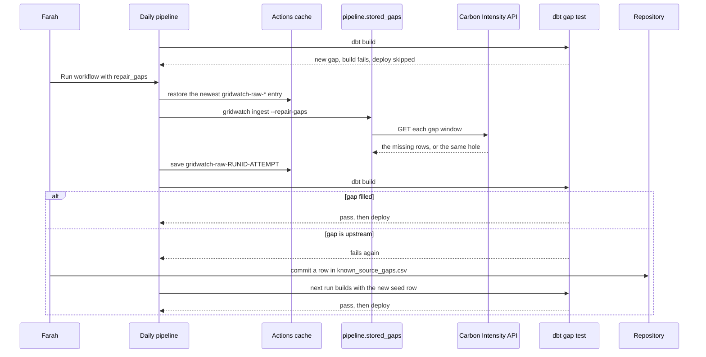
```mermaid
sequenceDiagram
    participant F as Farah
    participant W as Daily pipeline
    participant C as Actions cache
    participant I as pipeline.stored_gaps
    participant API as Carbon Intensity API
    participant T as dbt gap test
    participant R as Repository
    W->>T: dbt build
    T-->>W: new gap, build fails, deploy skipped
    F->>W: Run workflow with repair_gaps
    W->>C: restore the newest gridwatch-raw-* entry
    W->>I: gridwatch ingest --repair-gaps
    I->>API: GET each gap window
    API-->>I: the missing rows, or the same hole
    W->>C: save gridwatch-raw-RUNID-ATTEMPT
    W->>T: dbt build
    alt gap filled
        T-->>W: pass, then deploy
    else gap is upstream
        T-->>W: fails again
        F->>R: commit a row in known_source_gaps.csv
        W->>T: next run builds with the new seed row
        T-->>W: pass, then deploy
    end
```

**Failure and error paths.**

| What goes wrong | Detected in | What the system does | State left behind | Recovery |
| --- | --- | --- | --- | --- |
| The repair run's ingest fails part-way | `_ingest_ranges` | `IngestError`, exit 2 ([F2](#f2-incremental-ingestion-of-gb-data)) | Rows from earlier requests saved by *Save raw data* | Dispatch again with `repair_gaps` |
| The API still does not serve the half-hours | The gap test in the repair run | Build fails again, exit 2; deploy skipped | Raw cache updated; site unchanged | Record the gap in the seed (step 7) |
| The seed row does not cover the gap: a wrong `dataset` name, UK local times instead of UTC, or a range narrower than the gap | `no_half_hour_gaps` (its `not exists` match against the seed) | The test still fails | Site unchanged | Correct the row |
| A malformed timestamp in the seed | Loading the seed (`dbt/dbt_project.yml` sets `+column_types` of `gap_after_utc` and `resumes_at_utc` to `timestamp`) | The seed node errors and `dbt build` fails, exit 2 | Site unchanged | Fix the CSV value |
| The repair was done on Farah's machine only | By design | The workflow restores raw data from the Actions cache, not from a local copy, so the hole stays | | Use the workflow dispatch (runbook step 2) |
| The raw cache itself is broken, so every run fails the same way | Ingest or dbt, on every run | Each run fails | Site unchanged | Delete the `gridwatch-raw-*` entries under *Actions > Caches*; the next run backfills the whole history (about 335 requests by the runbook, 338 on 3 October 2026). Until Pages is enabled the forecast snapshots live only in that cache and in the 90-day `forecast-snapshots` artifacts, so restore them from an artifact first ([F3](#f3-forecast-snapshot-capture-and-archive)) or accept their loss |
| Known permanent gaps are requested again | `stored_gaps` does not consult the seed | Every `--repair-gaps` run re-requests the listed gaps (a few extra requests, not an error) | Unchanged | None; this is why daily runs leave the option off |
| Dispatch while a scheduled run is in progress | `concurrency: daily-pipeline` | The dispatched run waits, then restores the newest raw cache entry | | None |

## 6. Cross-cutting concerns

### Security model

- **No secrets, no accounts, no server.** Both sources are public; the dashboard is static and
  has no forms, cookies or login. The attack surface is the build pipeline and the integrity of
  published files.
- **Least-privilege workflow tokens.** Both workflows default to `contents: read`; only the
  Pages deploy job has `pages: write` and `id-token: write`, inside the `github-pages`
  environment. Workflow inputs and `SNAPSHOT_MIRROR_URL` reach the shell through `env:`.
- **Supply chain.** `uv.lock` with `uv sync --locked`; GitHub's own actions on major tags,
  third-party actions pinned to a commit with a version comment, every reference checked in CI;
  weekly Dependabot updates; the actionlint image is pinned in `ci.yml` and updated by hand
  ([decision 18](docs/decisions.md#18-pin-third-party-actions-to-a-commit-and-check-every-reference)).
- **Integrity of restored data.** The snapshot restore accepts only `YYYY/YYYY-MM.parquet` paths,
  checks each file against the manifest's SHA-256 and the snapshot schema, and stops on any
  failure other than 404. A site and its manifest could be replaced together by someone with
  write access to Pages; the hashes guard against corruption and partial uploads, not against
  that.
- **Output encoding.** Jinja2 autoescaping, `</script>`-safe JSON, and `textContent` for table
  cells.
- **Network in tests.** Blocked by pytest-socket inside pytest; dbt child processes are outside
  its reach ([decision 14](docs/decisions.md#14-tests-and-ci-never-call-the-network)).

### Configuration and secrets

- Runtime settings: the `GRIDWATCH_*` environment variables in [M1](#m1-configuration), defaults in
  `.env.example`; gridwatch does not read `.env` files.
- Analysis settings: dbt variables in `dbt/dbt_project.yml` ([M10](#m10-dbt-warehouse)); model
  settings as CLI options ([M2](#m2-command-line-interface)).
- Workflow settings: the repository variable `SNAPSHOT_MIRROR_URL` (optional) and the dispatch
  inputs `backtest` and `repair_gaps`.
- Secrets: none. `.gitignore` excludes `.env` and `.env.*` (except `.env.example`).

### Logging and observability

| Signal | Where |
| --- | --- |
| Application log lines (`time LEVEL logger: message`) | stderr; DEBUG and tracebacks with `--verbose` |
| Ingest report (requests, windows, inserted, updated, unchanged, files written, Ember status) | stdout of `gridwatch ingest` (JSON) |
| dbt node results and warnings | Log lines from `cmd_transform`; `data/dbt-target/run_results.json`; `data/dbt-logs/` |
| Step durations and exit codes, runner CPU count and memory | `scripts/ci_timed.sh`, then the *gridwatch step timings* job summary |
| Freshness for viewers | Dashboard header: "GB actuals through ...", "Page built ..."; forecast issue time; the backtest chart subtitle (number of forecasts and the first and last issue time). The backtest's generation time is only in `backtest_summary.json` and the workflow log |
| Provenance | Ember manifest (ETag, Last-Modified, SHA-256), Power BI and snapshot manifests, software versions in the report |
| Run history and artifacts | GitHub Actions (artifacts kept 14 to 90 days) |

There is no alerting beyond GitHub's own notifications for failed workflow runs.

### Performance

- Ingestion is bounded by politeness: at least one second per request. The cold-cache run on 3
  October 2026 took 18 minutes for 338 requests (national 118, generation 109, regional 109, one
  snapshot, one Ember download); a warm run re-requests only the last two days.
- Step wall-clock times from that run (GitHub API step timestamps, one run, not medians):
  restore 5 s, ingest 18 min 4 s, dbt build 17 s, forecast 26 s, backtest 5 min 3 s, exports,
  report, docs and site together 10 s; build job 24 min 28 s against a 120-minute limit.
- DuckDB's memory is capped by `GRIDWATCH_DUCKDB_MEMORY` (2 GB). The backtest runs weekly
  ([decision 15](docs/decisions.md#15-the-backtest-runs-weekly-in-the-daily-workflow)). The
  committed Power BI snapshot keeps 90 days of half-hourly rows; the daily export keeps 365.
- The dashboard ships Plotly.js locally (no CDN) and embeds aggregated tables plus the last two
  days of half-hourly values, the latest API 48-hour snapshot and the 96-row model forecast.

### Accessibility and internationalisation

- `lang="en-GB"`, a viewport meta tag and a single-column layout below 760 px.
- Each chart region has `role="img"` and an `aria-label`; every chart with data has a *Show the
  numbers* table with `scope="col"` headers.
- Persistence is drawn dotted, so it can be told from the model without colour; light and dark
  themes have their own colour steps ([decision 11](docs/decisions.md#11-dashboard-generated-html-with-plotly)).
- Numbers in tables use `en-GB` formatting. Times are UTC for half-hourly data and UK local time
  for scheduling results, as each chart says. The interface is English only; no translation is
  planned.

## 7. Execution roadmap

### Remaining files to be created, in order of implementation priority

Only work the repository itself records as pending, updates made necessary by the runs of 2
and 3 October 2026, and fixes for the discrepancy and edge cases found while preparing this plan
(items 5 and 6). Paths marked *proposed* do not exist yet and their names are suggestions.

| Priority | File | Purpose | Depends on | Acceptance criteria | Size |
| ---: | --- | --- | --- | --- | :---: |
| 1 | `README.md` (significant change) | Replace the "Not run yet" bullets about the workflows and the dashboard caption's "once the repository is published" with the real state | [D1](#decisions-farah-must-make); one successful *Daily pipeline* deploy | `https://fasharif.github.io/gridwatch/` serves the dashboard; `.../data/forecast_snapshots/manifest.json` answers 200; the README no longer says the workflows have not run | S |
| 2 | `dbt/models/exposures.yml` | Update the `gridwatch_dashboard` description ("The address goes live once the repository is published and Pages is enabled") | 1 | `gridwatch docs` builds; the description matches the live site | S |
| 3 | `docs/generated/timings-full.md` | Fill the pending full-workload table | The job summary of run 37116374067, or `uv run python scripts/time_pipeline.py --workload full` on an idle machine | No "pending" cells; runner, CPU count, memory and date stated; the column header matches the method (it says "Median seconds"; one run is not a median); the README's run-time bullet updated | S |
| 4 | `docs/generated/timings.md` | Fill the pending fixture-workload table | An idle machine | `uv run python scripts/time_pipeline.py --repeats 3` output committed; machine described | S |
| 5 | `src/gridwatch/report.py`, `src/gridwatch/dashboard/data.py` and `src/gridwatch/ingest/pipeline.py`, with tests in `tests/test_report_and_dashboard.py` and `tests/test_pipeline.py` | Fix the three edge cases in [D11](#decisions-farah-must-make): guard the `profile_overall` query in `build_report` and the key-figure query in `collect` so a window without complete days fails with the intended one-line message; check the 7-day bootstrap minimum before `saving_interval`; and stop a long ingest from skipping the snapshot (for example by taking the snapshot before the range datasets) | D11 | An empty window gives a one-line message and exit status 2 for both `report` and `site`; a window with 1 to 6 complete days gives the "too few complete days" message; a snapshot is still taken after an ingest that takes more than 30 minutes (tested with an injected clock); existing tests pass | S |
| 6 | `src/gridwatch/dashboard/data.py` (`_backtest` meta) and `src/gridwatch/dashboard/figures.py` (`backtest` subtitle), with a test in `tests/test_report_and_dashboard.py`; or, instead, `docs/decisions.md` record 15 | Record 15 says the page states when the backtest was generated, but the chart shows only the period tested: show `generated_at_utc`, or correct the record | None (choose one of the two) | Either the backtest chart subtitle shows the summary's `generated_at_utc` and a test asserts it, or record 15 no longer claims it; the plan's F7 row updated to match | S |
| 7 | `src/gridwatch/forecast/blend.py` and `tests/test_blend.py` (*proposed*), with changes to `forecast/service.py`, `forecast/backtest.py` and `docs/forecast.md` | README roadmap 1 (second half): blend the model with persistence for the first hours | None (data exists) | Weights chosen only on the validation period (`backtest --until 2025-09-24`); validation 0-1 h and 1-4 h MAE no worse than persistence; 24-48 h MAE no worse than the current model; a new validation row in the report; the "Limits" in `docs/forecast.md` updated | M |
| 8 | `powerbi/gridwatch.pbix` | FR-18: the Power BI report, built by following `powerbi/README.md` | [D6](#decisions-farah-must-make) | Four pages as in step 7 of the guide; the checks in step 8 pass (2025 daily mean about 129.2 gCO2/kWh, UAE 2024 about 467.5 gCO2e/kWh); attribution text box present | L |
| 9 | `powerbi/measures.dax` | Correct any measure that fails in Power BI and drop the "NOT yet tested" header | 8 | Every measure evaluates without error on the committed CSVs | S |
| 10 | `powerbi/README.md`, `dbt/models/exposures.yml` (`powerbi_star_schema`), `README.md`, plus a screenshot (`docs/images/powerbi-overview.png`, *proposed*) | Remove the "not built" notes once the report exists | 8, 9 | No document claims the report is missing; the screenshot shows the Overview page | S |
| 11 | `docs/findings.md` section (d) and a regenerated `docs/generated/report.md` | FR-21, README roadmap 2 (first half): like-for-like day-ahead accuracy of the API's forecast from stored snapshots | 1; weeks of daily runs; [D3](#decisions-farah-must-make) | The report's snapshot table has a 24-48 h band from at least the agreed number of snapshots; the findings quote it; `tests/test_docs_numbers.py` passes | M |
| 12 | A new ingestion module under `src/gridwatch/ingest/` and staging models under `dbt/models/staging/` (*proposed*, named after the source), with changes to `forecast/features.py`, `forecast/data.py` and tests | FR-22, README roadmap 1 (first half): wind and demand forecasts as model inputs | [D4](#decisions-farah-must-make) | Idempotent ingestion through `ParquetStore` with a recorded cassette; features use only forecasts issued at or before the origin (look-ahead test extended); validation run before the test year; Diebold-Mariano against the current model in the report | L |
| 13 | `src/gridwatch/forecast/data.py`, `features.py`, `model.py`, `backtest.py`; `tests/test_features.py`, `tests/test_model_and_backtest.py`; `docs/forecast.md` | FR-24, README roadmap 2 (second half): a model that uses the API's day-ahead forecast as an input | 11; several months of snapshots (findings, "Forecasting GB intensity 24 to 48 hours ahead") | Only snapshots issued at or before each origin are used (look-ahead test); backtest over the snapshot period with Diebold-Mariano against the current model | L |
| 14 | `src/gridwatch/ingest/ember.py` (second dataset), `dbt/models/staging/ember/stg_ember__monthly_electricity.sql` (*proposed*), a reporting model and a chart in `src/gridwatch/dashboard/figures.py` | FR-25, README roadmap 3: monthly Ember data for the GCC | [D5](#decisions-farah-must-make) | Conditional download and column checks as for the yearly file; recorded fixture; dbt tests on the new marts; dashboard chart with a table view | L |
| 15 | New reporting models beside `rpt_batch_job_savings` (*proposed*) and the matching report and dashboard changes | FR-26, README roadmap 4: marginal emissions in the scheduling analysis | [D7](#decisions-farah-must-make) | Source documented in `docs/data.md`; savings reported on both bases with bootstrap intervals | L |
| 16 | `scripts/generate_bank_holidays.py` (`LAST_YEAR`) and `dbt/seeds/uk_bank_holidays.csv` | Extend the bank-holiday seed beyond 2028 ([data.md](docs/data.md#data-quality)) | Before `dim_date` reaches 2028 (it runs two days past the data, so late December 2027), when `assert_bank_holidays_cover_next_year` starts warning | Seed regenerated; both bank-holiday tests pass | S |
| 17 | `.github/workflows/ci.yml` and `.github/workflows/pipeline.yml` (`runs-on`) | Only if [D8](#decisions-farah-must-make) is to pin the runner image | D8 | actionlint and `check_action_refs.py` pass; one CI run and one daily run green on the chosen image | S |

### Decisions Farah must make

| ID | Decision | Why it matters now |
| --- | --- | --- |
| D1 | Enable GitHub Pages (*Settings > Pages > Source: GitHub Actions*) and run *Daily pipeline* by hand | Until then every daily run fails at the deploy, the dashboard is offline, and the forecast snapshots exist only in the Actions cache and 90-day artifacts |
| D2 | Keep the default Pages address, or serve the site elsewhere and set `SNAPSHOT_MIRROR_URL` | The restore step reads the archive from that address; a 404 there is treated as "nothing published yet" |
| D3 | How many matured snapshots (or weeks) are enough to quote like-for-like accuracy | Sets when roadmap item 11 can start |
| D4 | Which wind and demand forecast source to use, and whether a source that needs a key is acceptable | gridwatch has no secrets today (NFR-4); a keyed source would add one to the workflow |
| D5 | Whether Ember's monthly data covers the GCC well enough, and under what licence | Roadmap item 14 depends on it |
| D6 | Whether to build the Power BI report | Needs Power BI Desktop on Windows and acceptance of Microsoft's licence terms ([decision 16](docs/decisions.md#16-power-bi-as-a-documented-star-schema-not-a-pbix)) |
| D7 | Which marginal-emissions source to use | Roadmap item 15 depends on it |
| D8 | Keep `ubuntu-latest` or pin `ubuntu-24.04` | GitHub annotated the runs: "The ubuntu-latest label will migrate to Ubuntu 26 beginning October 19, 2026" |
| D9 | How to handle GitHub disabling the schedule after 60 days without repository activity | The dashboard and the snapshot archive stop updating silently until the workflow is re-enabled |
| D10 | Whether a history of revised API actuals is worth keeping | Today revisions overwrite ([decision 3](docs/decisions.md#3-raw-layer-monthly-parquet-with-idempotent-upserts)) |
| D11 | Whether to address three edge cases found while preparing this plan (roadmap item 5): the snapshot is skipped when the GB ingestion before it takes more than 30 minutes ([F3](#f3-forecast-snapshot-capture-and-archive)); `gridwatch site` raises an uncaught `IndexError` when the start-slot table is empty ([F9](#f9-dashboard-build-and-viewing)); and `gridwatch report` raises an uncaught polars `OutOfBoundsError` when no day in the window has every rule scored, so its intended "too few complete days" message is never reached ([F8](#f8-report-and-the-docs-number-check)) | None is in the repository's roadmap; the first could lose a snapshot on a slow cold-cache run, and the other two end in a traceback instead of a one-line message |
