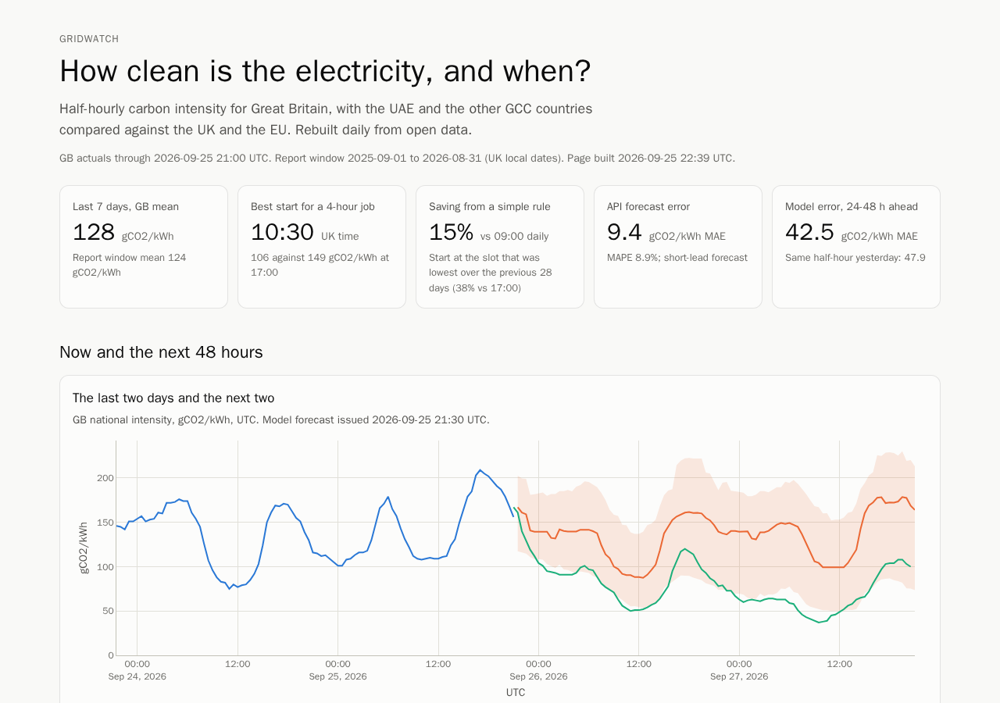
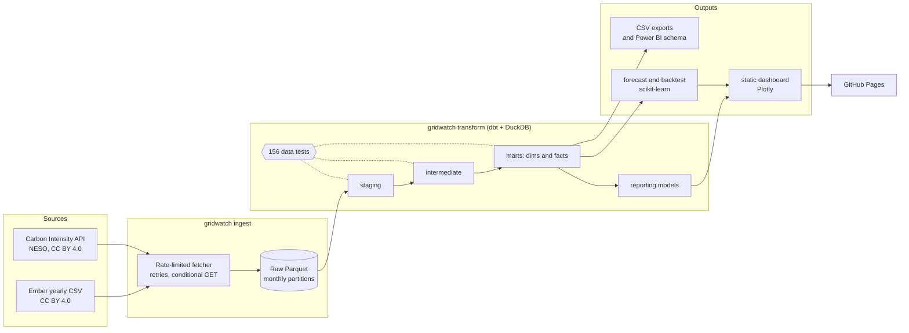

# gridwatch

How clean is electricity, and when? A daily data pipeline, warehouse, forecast and dashboard
for the carbon intensity of electricity in Great Britain, with the UAE and the other GCC
countries compared against the UK and the EU.

[](https://github.com/fasharif/gridwatch/actions/workflows/ci.yml)



*The dashboard built from the run on 25 September 2026, captured with headless Chromium by
`scripts/screenshot.py`; see also the [dark theme](docs/images/dashboard-dark.png) and the
[phone layout](docs/images/dashboard-mobile.png). The daily workflow rebuilds the page.*

**Headline results** from that run ([full findings](docs/findings.md)):

- A flexible four-hour job in GB saw the least carbon when started at **10:30 UK time**
  (106 gCO2/kWh on average, September 2025 to August 2026) and the most at **17:00** (150).
- Starting each day at the time that was cleanest over the previous four weeks cut the job's
  emissions by **15%** against a fixed 09:00 start and **38%** against 17:00, with no
  forecast at all.
- In 2024 a kWh in the **UAE** carried **2.2 times** the lifecycle emissions of a kWh in the
  UK, and the GCC as a whole **2.9 times**. The UAE's intensity fell 31% between 2015 and
  2024, mostly thanks to nuclear power; the rest of the GCC barely moved.
- gridwatch's 24-48 hour forecast had an MAE of **42.5 gCO2/kWh**, 11% better than repeating
  the last known day, but it lost to that baseline on 42% of days and is far behind the
  API's own short-lead forecast (9.9).

## The problem

In the year to August 2026 the cleanest tenth of half-hours on the GB grid came in under
57 gCO2/kWh and the dirtiest tenth over 201, and the pattern shifts with the seasons, the
weather and the region. Anyone who can move a load in time, from a nightly batch job to
charging a fleet, needs to know when the clean hours are, how much moving actually saves, and
how far ahead that can be predicted. For the Gulf, the
question is how far behind the UK and EU its grids are and whether the gap is closing.

The open data exists, but it is spread over two sources with different units, gaps, upstream
errors and undocumented API behaviour. gridwatch turns it into a tested warehouse, answers
those questions in SQL, and publishes the results as a dashboard and reusable CSV files.

## Features

- **Incremental, idempotent ingestion** of the GB Carbon Intensity API (national intensity
  since 2017, generation mix, 18 regions) and Ember's yearly data, with rate limiting,
  retries, conditional downloads, gap repair and raw data kept as Parquet.
- **A dimensional dbt project** on DuckDB: staging, intermediate and mart layers with date,
  time-of-day, region, fuel and country dimensions, and 200 dbt nodes including 156 data
  tests. Custom tests check for gaps in half-hourly series, freshness, plausible ranges and
  generation shares that add up.
- **Business questions answered in SQL:** the best time to run a flexible job and the carbon
  saved by seven scheduling rules, GCC against UK and EU, seasonal and regional variation, and
  the accuracy of the API's own forecast.
- **A 48-hour forecast** with calibrated 10-90% intervals and a year-long rolling-origin
  backtest against naive baselines and the API.
- **A static dashboard** with a table view for every chart, and a daily workflow that
  rebuilds it and deploys it to GitHub Pages.
- **Exports:** [`exports/annual_grid_intensity.csv`](exports/annual_grid_intensity.csv) for
  other projects' carbon estimates, and a Power BI star schema with DAX measures.

## Architecture



A scheduled GitHub Actions workflow runs the whole chain daily. Raw data and model outputs
persist between runs in the Actions cache, never in git (see
[decision 12](docs/decisions.md#12-keeping-history-between-scheduled-runs)).

## Tech stack and why

| Layer | Choice | Why |
| --- | --- | --- |
| Language | Python 3.12, uv, ruff, mypy (strict) | dbt supports it; uv gives a lockfile and reproducible installs |
| Storage | Parquet, DuckDB | No server, reads Parquet directly, fast enough for 9 years of half-hours |
| Transformation | dbt-core with dbt-duckdb | Versioned SQL, lineage, and tests next to the models |
| Data frames | polars | Typed, fast, and strict about schemas at the ingestion boundary |
| Forecasting | scikit-learn `HistGradientBoostingRegressor` | Handles missing values and quantile loss with no system libraries ([reasoning](docs/forecast.md#why-scikit-learn)) |
| Dashboard | Jinja2 and Plotly, static HTML | One language end to end, no Node build, no secrets ([decision 11](docs/decisions.md#11-dashboard-generated-html-with-plotly)) |
| CI and scheduling | GitHub Actions, Pages, Dependabot | Free for public repositories |

## Quick start

Needs [uv](https://docs.astral.sh/uv/) (it installs Python 3.12 if needed) and network access.

```bash
git clone https://github.com/fasharif/gridwatch.git && cd gridwatch
uv sync --locked
uv run gridwatch run    # first run backfills 9 years; the year-long backtest is the slowest step
```

Then open `site/index.html` in a browser. Later runs fetch only new data. To try it offline on
the recorded fixture instead:

```bash
set -a; . tests/fixtures/fixture.env; set +a; export GRIDWATCH_DATA_DIR=data/demo
uv run gridwatch run --replay tests/fixtures/cassette --as-of "$FIXTURE_AS_OF" --skip-backtest --train-days 30
```

Each step can also run on its own: `gridwatch ingest`, `transform`, `forecast`, `backtest`,
`report`, `export` and `site` (`uv run gridwatch --help`).

## Configuration

Everything is optional; defaults are in [`.env.example`](.env.example). gridwatch reads
environment variables only.

| Variable | Default | Meaning |
| --- | --- | --- |
| `GRIDWATCH_DATA_DIR` | `data` | Raw Parquet, the DuckDB warehouse and model outputs |
| `GRIDWATCH_NATIONAL_START` | `2017-09-26` | First national half-hour to ingest |
| `GRIDWATCH_GENERATION_START` | `2018-05-10T23:30` | First generation-mix half-hour |
| `GRIDWATCH_REGIONAL_START` | `2023-01-01` | First regional half-hour (regional data is large) |
| `GRIDWATCH_REFETCH_DAYS` | `2` | Recent days re-requested each run, because actuals get revised |
| `GRIDWATCH_MIN_REQUEST_INTERVAL` | `1.0` | Seconds between API requests |
| `GRIDWATCH_MAX_ATTEMPTS` | `5` | Attempts per request before giving up |
| `GRIDWATCH_HTTP_TIMEOUT` | `60` | Seconds per request |
| `GRIDWATCH_DUCKDB_MEMORY` | `2GB` | DuckDB memory limit during the dbt build |

Analysis settings live in `dbt/dbt_project.yml` as dbt variables: job length
(`batch_job_hours`), the report window, the plausible range for intensity values and the
freshness threshold. An invalid environment value stops the run with a message that names
the variable.

## Running the tests

```bash
uv run pytest                  # 118 tests, no network (pytest-socket blocks it)
uv run ruff check . && uv run ruff format --check . && uv run mypy
```

The suite includes an end-to-end test that replays the recorded API responses in
`tests/fixtures/cassette` through ingestion, the full dbt build and its data tests, the
forecast, a short backtest, the report, the exports and the dashboard. CI runs the same
pipeline as a separate job and uploads the dashboard it built. Coverage on the last local run
was 93% of statements.

## Folder structure

```text
gridwatch/
├── src/gridwatch/
│   ├── ingest/          # HTTP client, API parsing, Parquet store, Ember, cassettes
│   ├── forecast/        # features, model, baselines, metrics, backtest
│   ├── dashboard/       # data collection, Plotly specs, HTML template, CSS and JS
│   ├── cli.py           # the gridwatch command
│   ├── transform.py     # runs dbt
│   ├── report.py        # tables behind docs/findings.md
│   └── export.py        # annual CSV and Power BI star schema
├── dbt/                 # dbt project: models, seeds, macros, generic and singular tests
├── tests/               # pytest suite, fake API and recorded cassette
├── scripts/             # fixture recording, bank-holiday seed, screenshots, timings
├── docs/                # findings, data, forecast method, decisions, generated tables
├── exports/             # annual_grid_intensity.csv
├── powerbi/             # star-schema CSVs, DAX measures, build guide
└── .github/             # CI, daily pipeline and Pages deploy, Dependabot
```

## Design decisions

Seventeen short records in [docs/decisions.md](docs/decisions.md), covering the warehouse,
the raw layer, the API workarounds, data quality, the forecasting library, the dashboard and
how history is kept between scheduled runs. Data sources, licences and quirks are in
[docs/data.md](docs/data.md).

## Limitations and roadmap

**Not run yet**

- **The GitHub workflows have not run on GitHub.** They pass actionlint, and the steps they
  run were run locally on Windows 11 and in a Linux `python:3.12-slim` container, but the
  first real runs happen after the repository is published.
  To enable the dashboard, set *Settings > Pages > Source* to *GitHub Actions*, then run the
  *Daily pipeline* workflow once by hand (*Actions > Daily pipeline > Run workflow*, with
  *backtest* ticked).
- **The Power BI report is not built.** [`powerbi/`](powerbi/README.md) has the data, the DAX
  measures (untested in Power BI) and a step-by-step guide.
- **Like-for-like forecast accuracy.** The API does not keep its day-ahead forecasts, so
  gridwatch stores one snapshot per run. The comparison by lead time
  (`rpt_api_forecast_snapshot_accuracy`) needs weeks of daily runs before it means anything.
- **Run times** are not published yet: the build machine was shared with other heavy jobs,
  so timings from it would mislead. [docs/generated/timings.md](docs/generated/timings.md) is
  a pending table; `uv run python scripts/time_pipeline.py` fills it on an idle machine.

**Known limitations**

- The forecast uses no weather, demand or generation forecasts, so it cannot match the API.
- Regional values are the API's modelled forecasts; there are no regional actuals.
- Ember's GCC figures rest on annual statistics and one gas emission factor per country.
- Revised API actuals overwrite old values; the history of revisions is not kept.

**Roadmap**

1. Add wind and demand forecasts as model inputs.
2. Report day-ahead API accuracy from the stored snapshots once enough have matured.
3. Monthly Ember data for the GCC, to show the summer cooling peak.
4. Marginal rather than average emissions for the scheduling analysis.

## Licence

Code: [MIT](LICENSE), Copyright (c) 2026 Farah Sharif.

Data: Carbon Intensity API, National Energy System Operator (CC BY 4.0); Ember Yearly
Electricity Data (CC BY 4.0). Exported files keep the source and licence on every row.
gridwatch is not affiliated with either organisation.
