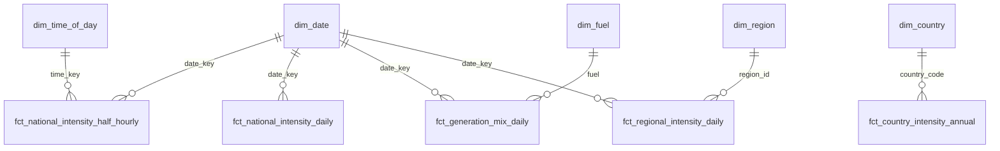

# Power BI

> **Status: not built yet.** There is no `.pbix` file in this repository. A report has to be
> authored by hand in Power BI Desktop, an interactive application whose installation needs
> Microsoft's licence terms accepted, so it was not part of this automated build. What is
> here is everything needed to build it: the star schema as CSV, the DAX measures (not yet
> tested in Power BI) and the steps below. The same analysis is already in the static
> dashboard, which CI builds.

## What is in this folder

| Path | Contents |
| --- | --- |
| `data/` | Star schema exported by `gridwatch export --powerbi-dir powerbi/data --half-hourly-days 90`. `manifest.json` records when it was generated and the row counts. |
| `measures.dax` | DAX measures to paste into the model |

The committed snapshot was generated on 2026-09-25 from the pipeline run described in
[docs/findings.md](../docs/findings.md): GB actuals up to 2026-09-25 21:00 UTC. The daily
workflow also publishes a fresh copy of these files on the GitHub Pages site under
`downloads/powerbi/`.

## Star schema

| Table | Grain | Rows in snapshot |
| --- | --- | ---: |
| `dim_date` | UK local calendar date, 2017-09-26 to 2026-09-27 | 3,289 |
| `dim_time_of_day` | Half-hour slot of the UK local day | 48 |
| `dim_region` | GB region (14 DNO regions, 4 aggregates) | 18 |
| `dim_fuel` | Fuel in the generation mix | 9 |
| `dim_country` | Compared country or region (Ember area) | 9 |
| `fct_national_intensity_half_hourly` | GB half-hour, last 90 days | 4,321 |
| `fct_national_intensity_daily` | GB day, full history | 3,287 |
| `fct_generation_mix_daily` | GB day and fuel | 27,504 |
| `fct_regional_intensity_daily` | Day and region, from 2023 | 24,534 |
| `fct_country_intensity_annual` | Country and year (Ember) | 276 |

Units: GB tables are gCO2/kWh (operational, Carbon Intensity API). The country table is
gCO2e/kWh (lifecycle, Ember). Do not put the two on the same axis.

## Build guide

1. **Refresh the data (optional).** Run the pipeline (`uv run gridwatch run --skip-backtest`)
   and export a newer snapshot with
   `uv run gridwatch export --powerbi-dir powerbi/data --half-hourly-days 90`, or download the
   CSVs from the Pages site.
2. **Load the CSVs.** In Power BI Desktop choose *Get data > Text/CSV* and load each file in
   `data/` (or *Get data > Folder* on `data/` and expand each file). Keep the file names as
   table names.
3. **Set data types** in Power Query:
   - `date_key`, `time_key`, `region_id`, `year`, counts: Whole number.
   - `calendar_date`: Date. `period_start_utc` and `period_start_local`: Date/Time.
   - Measures such as `actual_gco2_kwh` and `*_pct`: Decimal number.
   - `is_*` columns: True/False.
4. **Create relationships** in Model view, all many-to-one, single direction, from each fact
   to its dimensions, as in the diagram. Leave `fct_country_intensity_annual[year]`
   unrelated to `dim_date`; it is an annual table.
5. **Mark `dim_date` as a date table** on `calendar_date`. Sort `month_name` by
   `month_of_year`, `day_name` by `iso_day_of_week` and `start_time_label` by `time_key`.
   Hide the key columns in the fact tables.
6. **Add the measures.** Create an empty table named `Measures` (*Enter data*), then add each
   measure from `measures.dax`. Set percentage measures to one decimal place.
7. **Build four pages:**
   - *Overview*: cards for `Daily Mean Intensity (gCO2/kWh)`, `Low-Carbon Share %` and
     `API Forecast MAE (gCO2/kWh)`; a line chart of `Daily Mean Intensity` by
     `dim_date[calendar_date]`; a slicer on `dim_date[calendar_year]`.
   - *When to run*: a matrix with `dim_date[day_name]` on rows, `dim_time_of_day[start_time_label]`
     on columns and `Mean Intensity (gCO2/kWh)` as values, with a background colour scale
     (one hue, light to dark); a card for `Lowest-Carbon Half-Hour`.
   - *Regions*: a bar chart of `Regional Mean Forecast (gCO2/kWh)` by
     `dim_region[region_short_name]`, filtered to `is_aggregate = False`, sorted ascending.
   - *Countries*: a line chart of `Country Intensity (gCO2e/kWh)` by
     `fct_country_intensity_annual[year]` with `dim_country[country_name]` as the legend; a
     table with `Country Intensity vs UK (x)` and `Country Intensity Change Since 2015 %`.
8. **Check against the pipeline.** With the full history loaded, `Daily Mean Intensity` for
   2025 should be about 129.2 gCO2/kWh (weighting by half-hours reproduces the pipeline's
   half-hourly mean), and `Country Intensity (gCO2e/kWh)` for the United Arab Emirates in
   2024 about 467.5. Large differences point to a type or relationship error.
9. **Attribution.** Add a text box: "Data: Carbon Intensity API, National Energy System
   Operator (CC BY 4.0); Ember Yearly Electricity Data (CC BY 4.0)."

When the report exists, save it as `powerbi/gridwatch.pbix`, add a screenshot, and remove the
"not built yet" note above.
